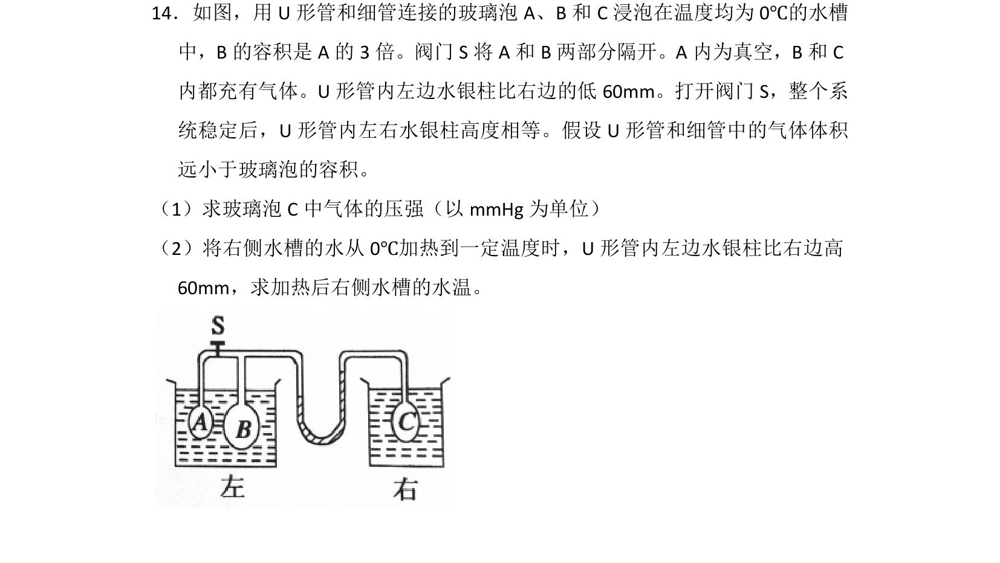
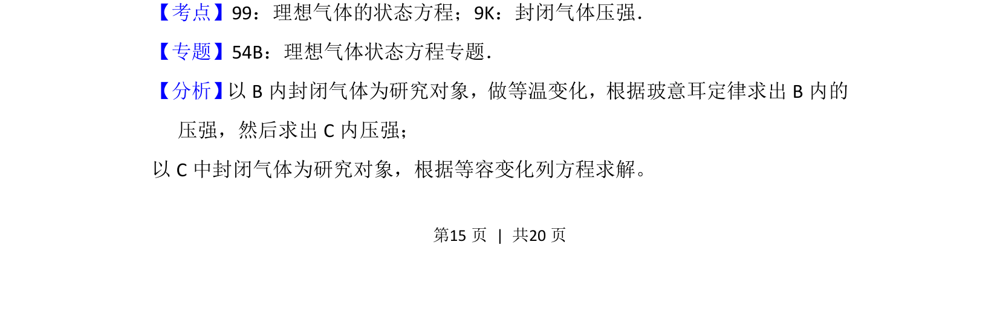
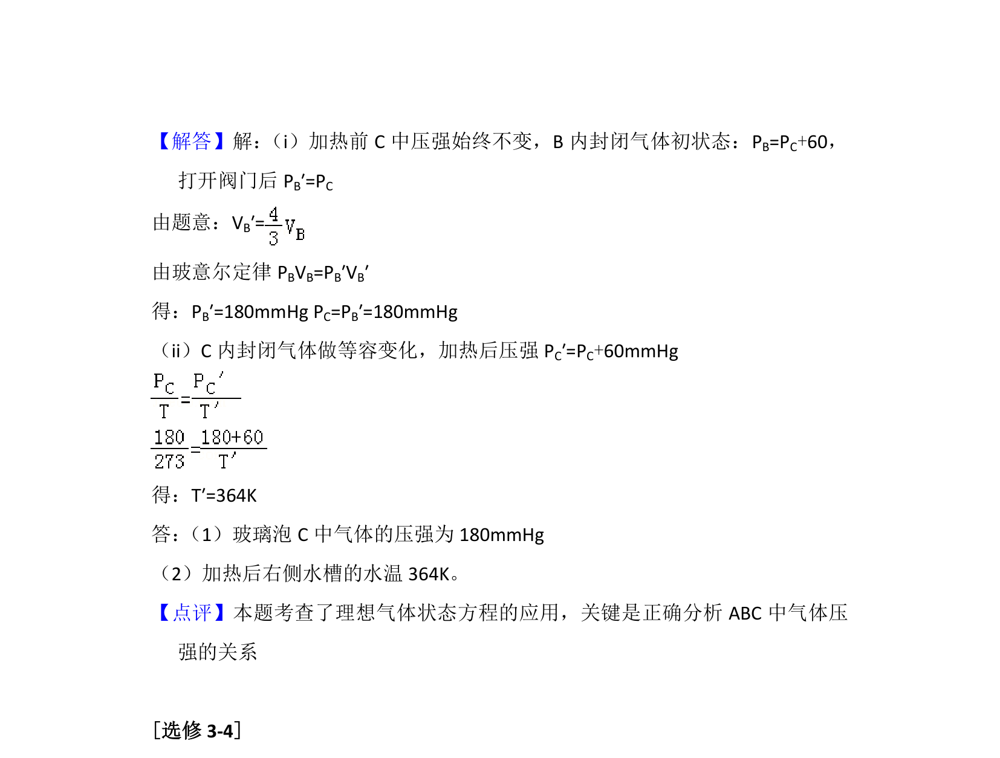

## 题面

## 摘要

研究U形管连接的玻璃泡中气体压强及加热后的温度变化

## 关联考点

- [[446-理想气体状态方程|理想气体状态方程]]
- [[591-封闭气体压强|封闭气体压强]]
- [[444-玻意耳定律|等温变化]]
- [[430-查理定律|等容变化]]

## 答案与解析

> 📄 原 PDF 第 15 页：`素材/真题/湖南/2008-2024·（湖南）物理高考真题/2012年高考物理试卷（新课标）（解析卷）.pdf`
