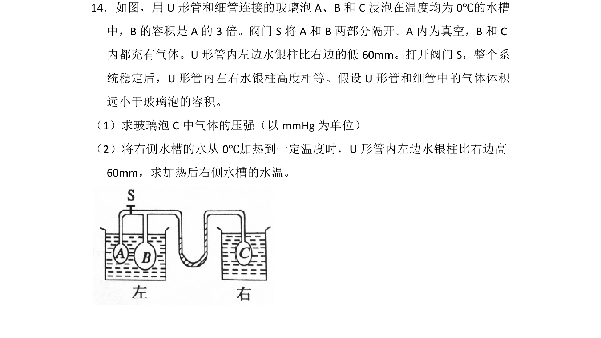
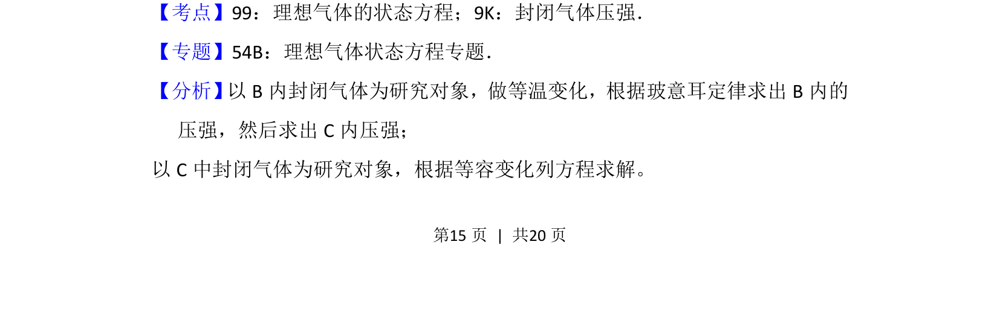
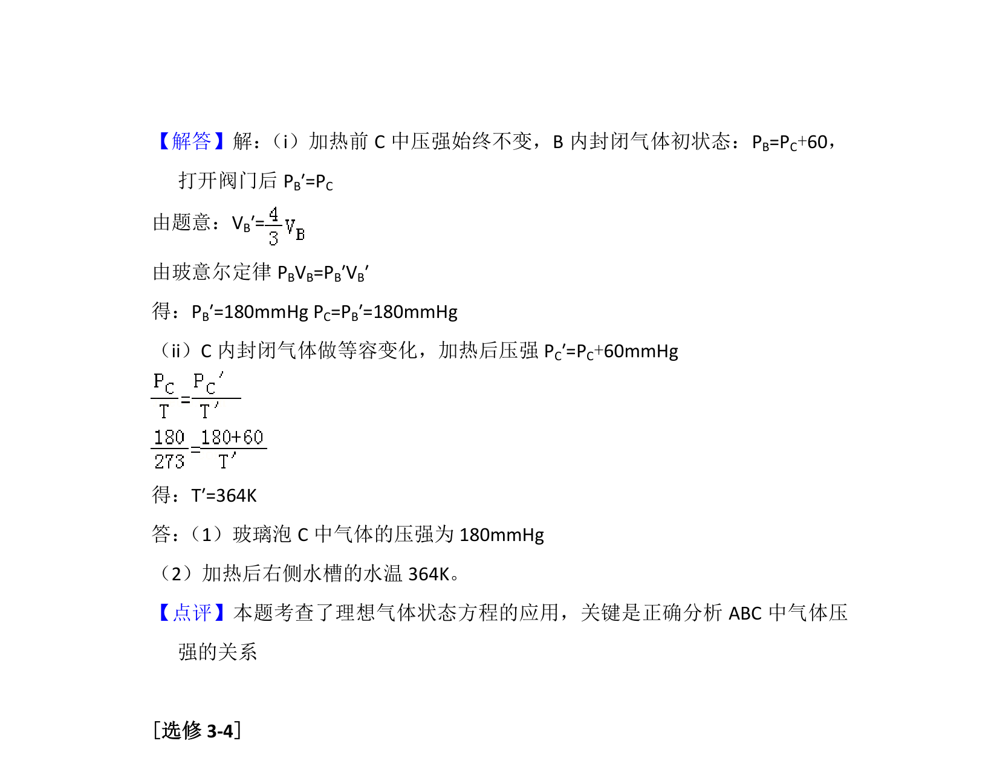

## 题面

## 摘要

研究U形管连接的玻璃泡中气体压强及加热后的温度变化

## 关联考点

- [[446-理想气体状态方程|理想气体状态方程]]
- [[591-封闭气体压强|封闭气体压强]]
- [[444-玻意耳定律|等温变化]]
- [[430-查理定律|等容变化]]

## 答案与解析

> 📄 原 PDF 第 15 页：`素材/真题/湖南/2008-2024·（湖南）物理高考真题/2012年高考物理试卷（新课标）（解析卷）.pdf`

<!-- 题干文本-start -->
## 题干文本
14．如图，用U形管和细管连接的玻璃泡A、B和C浸泡在温度均为0℃的水槽
中，B的容积是A的3倍。阀门S将A和B两部分隔开。A内为真空，B和C
内都充有气体。U形管内左边水银柱比右边的低60mm。打开阀门S，整个系
统稳定后，U形管内左右水银柱高度相等。假设U形管和细管中的气体体积
远小于玻璃泡的容积。
（1）求玻璃泡C中气体的压强（以mmHg为单位）
（2）将右侧水槽的水从0℃加热到一定温度时，U形管内左边水银柱比右边高
60mm，求加热后右侧水槽的水温。
<!-- 题干文本-end -->

<!-- 解析文本-start -->
## 解析文本
【考点】99：理想气体的状态方程；9K：封闭气体压强．菁优网版权所有
【专题】54B：理想气体状态方程专题．
【分析】 以B内封闭气体为研究对象，做等温变化，根据玻意耳定律求出B内的
压强，然后求出C内压强；
以C中封闭气体为研究对象，根据等容变化列方程求解。
<!-- 解析文本-end -->
