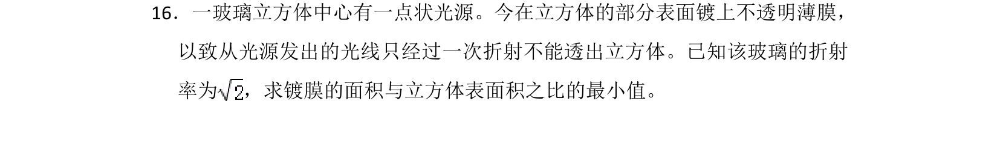
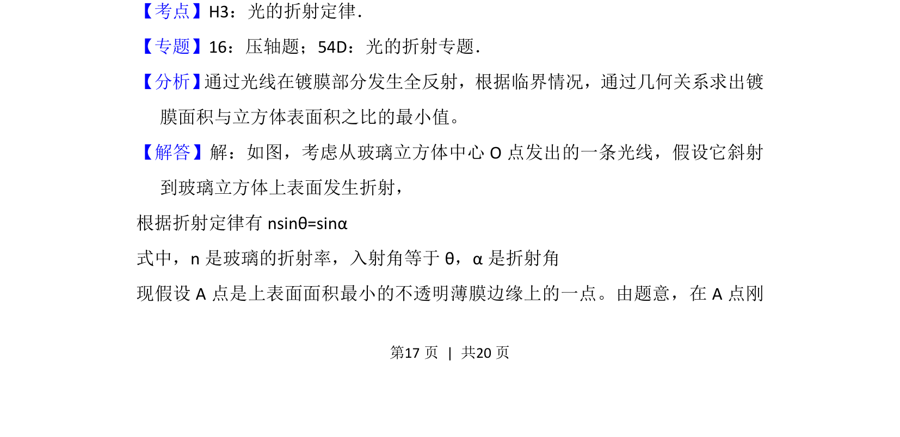
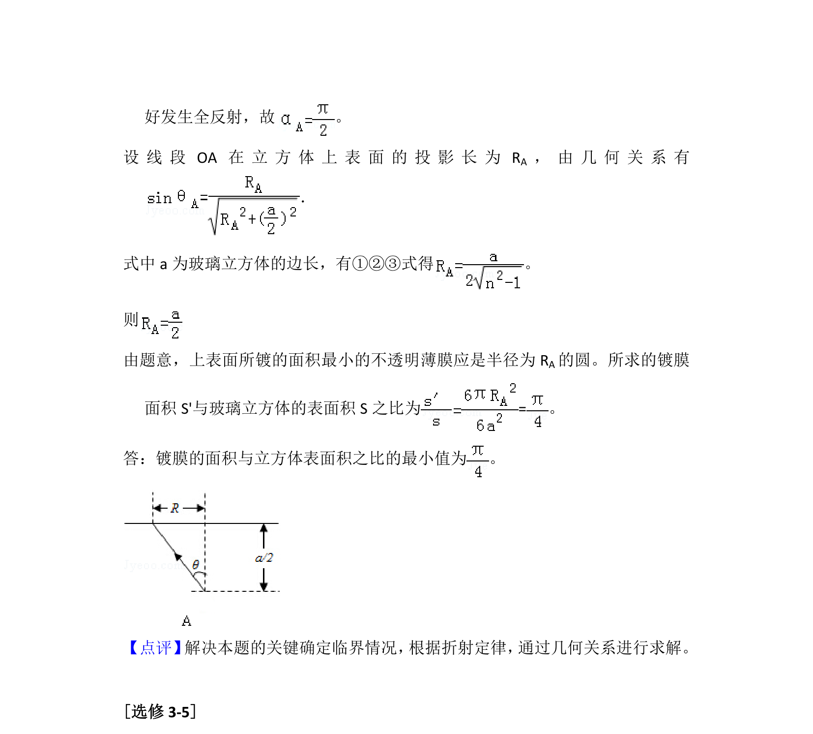

## 题面

## 摘要

考查光的折射与全反射，求解镀膜面积与立方体表面积比的最小值。

## 关联考点

- [[520-光的折射定律|光的折射定律]]
- [[343-全反射|全反射]]
- [[455-几何光学|几何光学]]

## 答案与解析

> 📄 原 PDF 第 17 页：`素材/真题/湖南/2008-2024·（湖南）物理高考真题/2012年高考物理试卷（新课标）（解析卷）.pdf`
