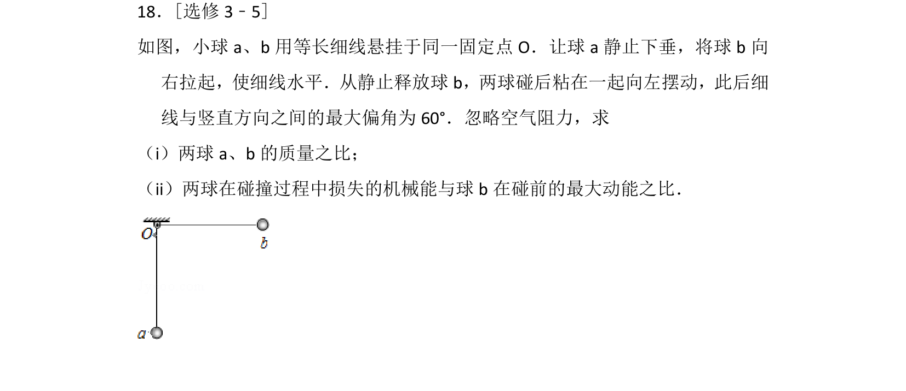
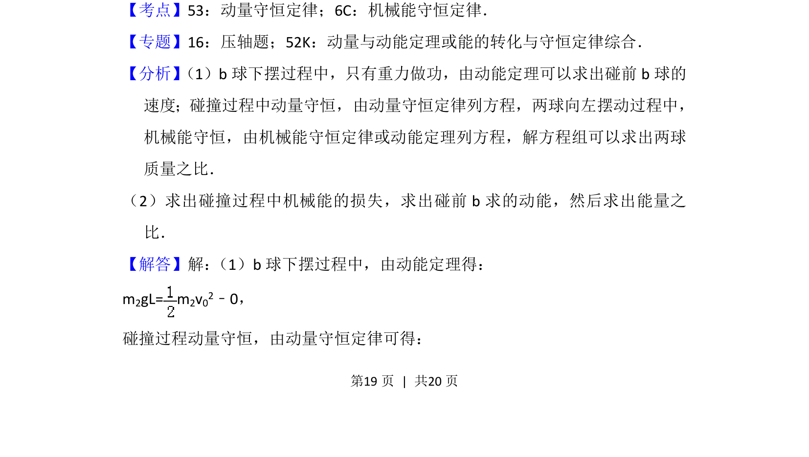
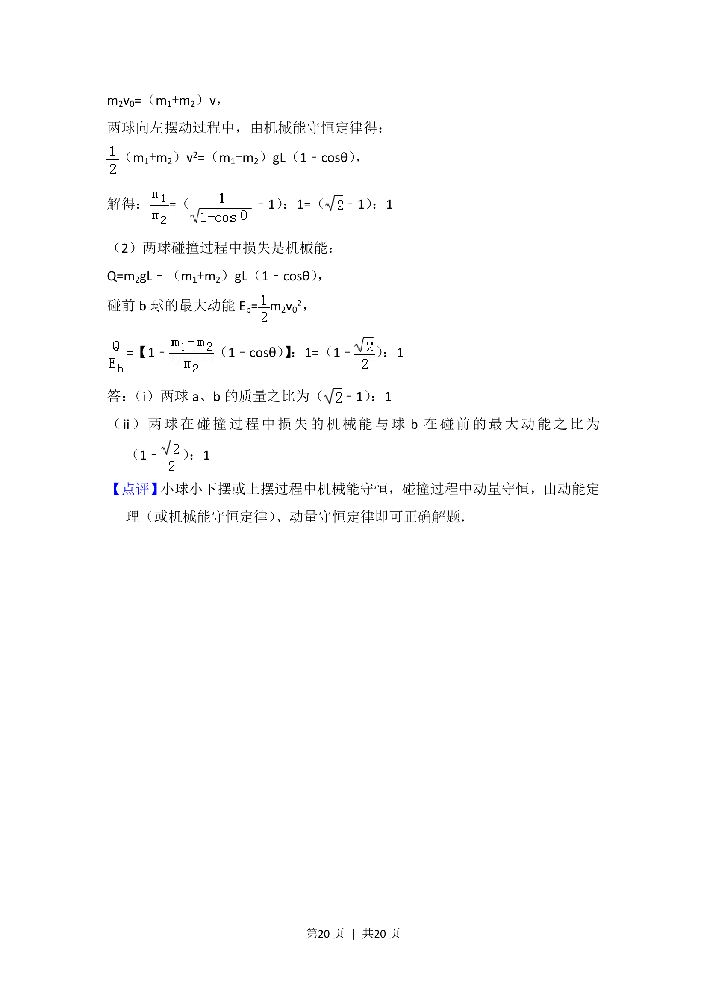

## 题面

## 摘要

小球b下摆、两球碰撞粘合后上摆，综合考查动量守恒与机械能守恒的应用。

## 关联考点

- [[347-动量守恒定律|动量守恒定律]]
- [[085-机械能守恒-初中|机械能守恒定律]]
- [[251-动能定理|动能定理]]
- [[能量损失计算]]

## 答案与解析

> 📄 原 PDF 第 19 页：`素材/真题/湖南/2008-2024·（湖南）物理高考真题/2012年高考物理试卷（新课标）（解析卷）.pdf`
