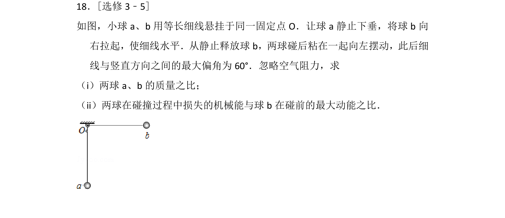
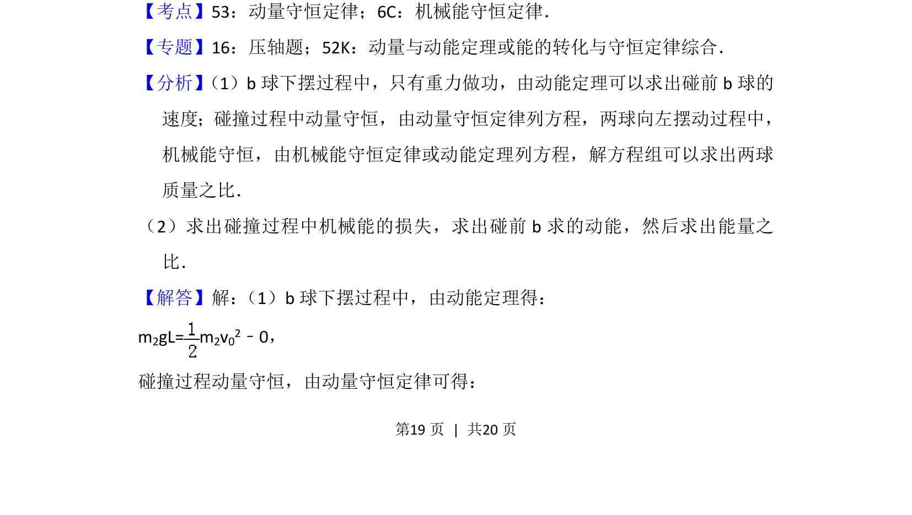
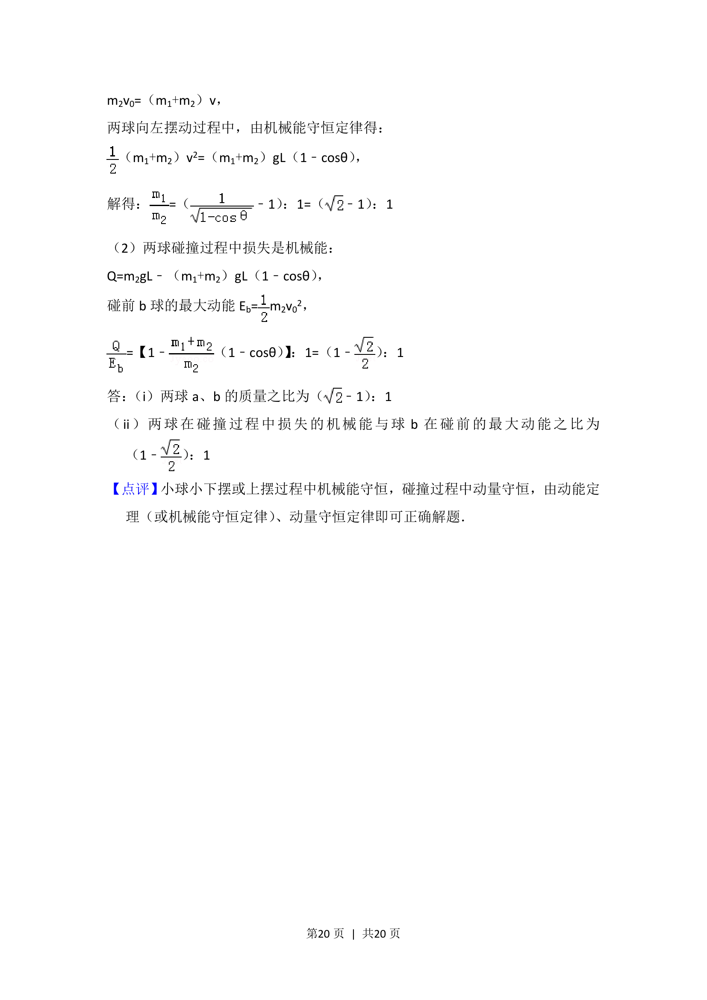

## 题面

## 摘要

小球b下摆、两球碰撞粘合后上摆，综合考查动量守恒与机械能守恒的应用。

## 关联考点

- [[347-动量守恒定律|动量守恒定律]]
- [[085-机械能守恒-初中|机械能守恒定律]]
- [[251-动能定理|动能定理]]
- [[能量损失计算]]

## 答案与解析

> 📄 原 PDF 第 19 页：`素材/真题/湖南/2008-2024·（湖南）物理高考真题/2012年高考物理试卷（新课标）（解析卷）.pdf`

<!-- 题干文本-start -->
## 题干文本
18．[选修3﹣5]
如图，小球a、b用等长细线悬挂于同一固定点O．让球a静止下垂，将球b向
右拉起，使细线水平．从静止释放球b，两球碰后粘在一起向左摆动，此后细
线与竖直方向之间的最大偏角为60°．忽略空气阻力，求
（i）两球a、b的质量之比；
（ii）两球在碰撞过程中损失的机械能与球b在碰前的最大动能之比．
<!-- 题干文本-end -->

<!-- 解析文本-start -->
## 解析文本
【考点】53：动量守恒定律；6C：机械能守恒定律．菁优网版权所有
【专题】16：压轴题；52K：动量与动能定理或能的转化与守恒定律综合．
【分析】 （1）b球下摆过程中，只有重力做功，由动能定理可以求出碰前b球的
速度；碰撞过程中动量守恒，由动量守恒定律列方程，两球向左摆动过程中，
机械能守恒，由机械能守恒定律或动能定理列方程，解方程组可以求出两球
质量之比．
（2）求出碰撞过程中机械能的损失，求出碰前b求的动能，然后求出能量之
比．
【解答】解： （1）b球下摆过程中，由动能定理得：
m2gL= m 2v02﹣0，
碰撞过程动量守恒，由动量守恒定律可得：
<!-- 解析文本-end -->
