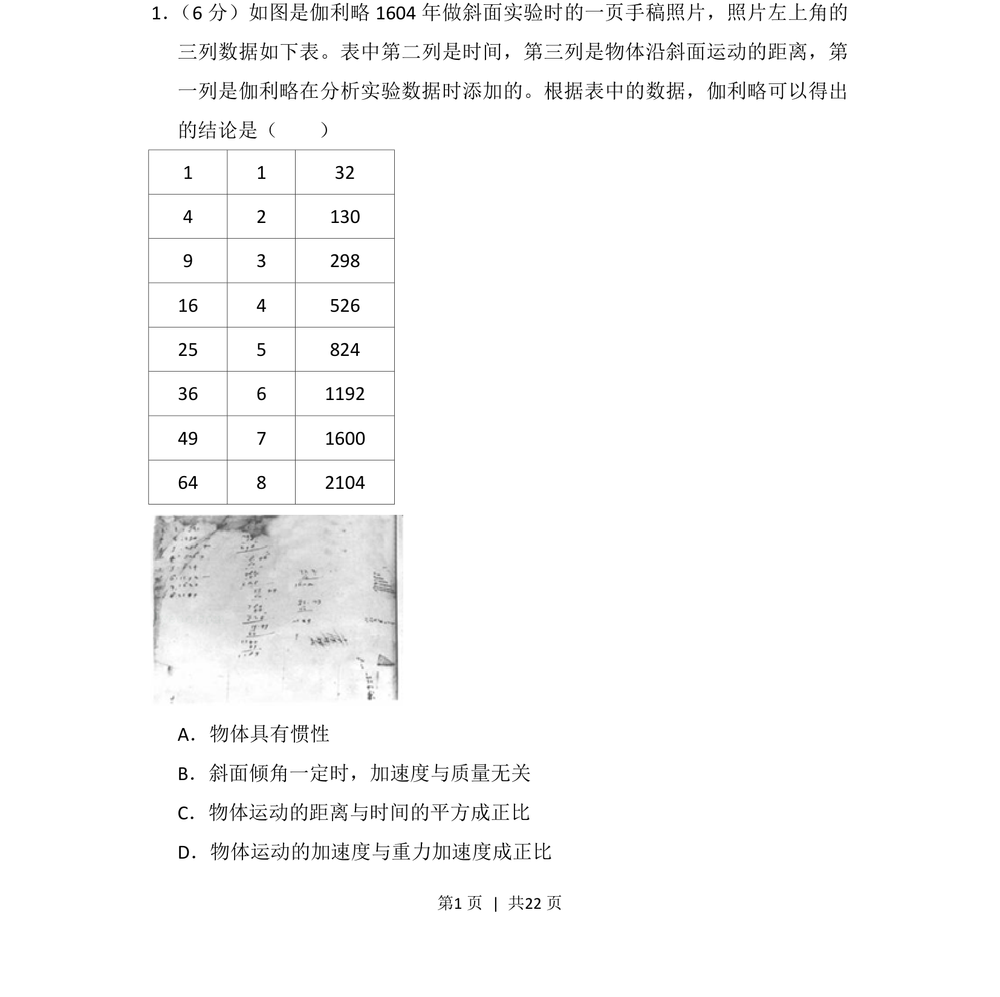
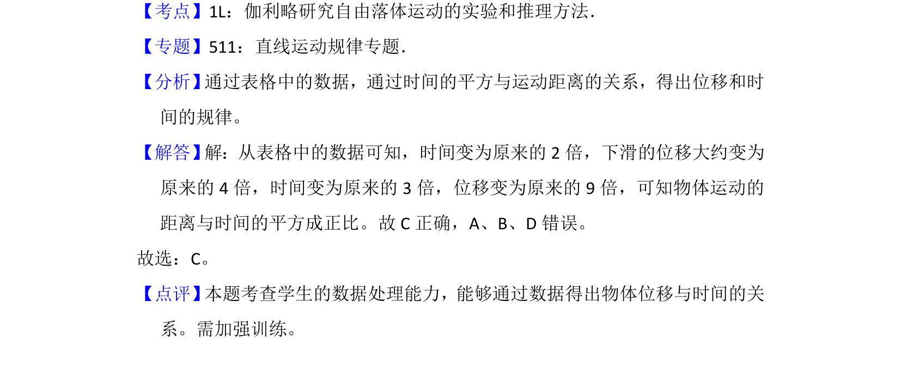

## 题面

## 摘要

通过伽利略斜面实验数据，判断物体运动距离与时间平方成正比的关系。

## 关联考点

- [[202-伽利略斜面实验|伽利略斜面实验]]
- [[215-匀变速直线运动|匀变速直线运动]]
- [[位移时间关系]]

## 答案与解析

> 📄 原 PDF 第 1 页：`素材/真题/湖南/2008-2024·（湖南）物理高考真题/2013年高考物理试卷（新课标Ⅰ）（解析卷）.pdf`
