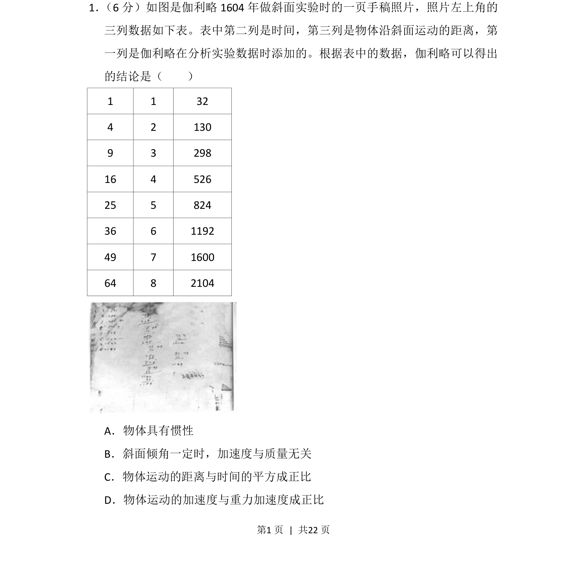
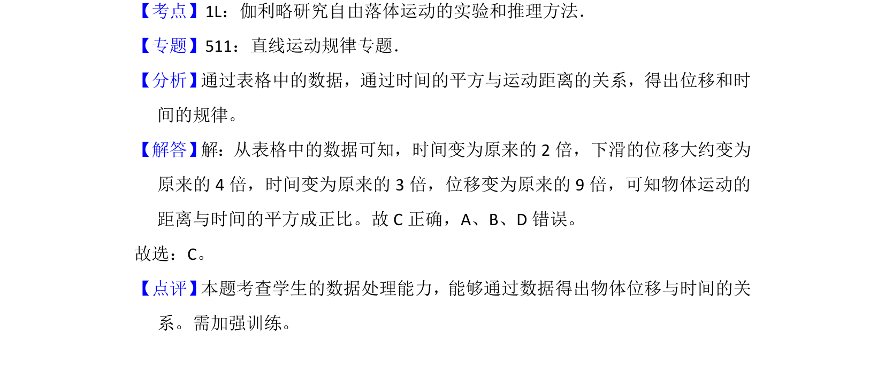

## 题面

## 摘要

通过伽利略斜面实验数据，判断物体运动距离与时间平方成正比的关系。

## 关联考点

- [[202-伽利略斜面实验|伽利略斜面实验]]
- [[215-匀变速直线运动|匀变速直线运动]]
- [[位移时间关系]]

## 答案与解析

> 📄 原 PDF 第 1 页：`素材/真题/湖南/2008-2024·（湖南）物理高考真题/2013年高考物理试卷（新课标Ⅰ）（解析卷）.pdf`

<!-- 题干文本-start -->
## 题干文本
1． （6分）如图是伽利略1604年做斜面实验时的一页手稿照片，照片左上角的
三列数据如下表。表中第二列是时间，第三列是物体沿斜面运动的距离，第
一列是伽利略在分析实验数据时添加的。根据表中的数据，伽利略可以得出
的结论是（　　）
1 1 32
4 2 130
9 3 298
16 4 526
25 5 824
36 6 1192
49 7 1600
64 8 2104
A．物体具有惯性
B．斜面倾角一定时，加速度与质量无关
C．物体运动的距离与时间的平方成正比
D．物体运动的加速度与重力加速度成正比
<!-- 题干文本-end -->

<!-- 解析文本-start -->
## 解析文本

<!-- 解析文本-end -->
