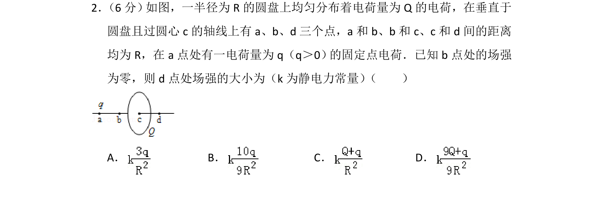
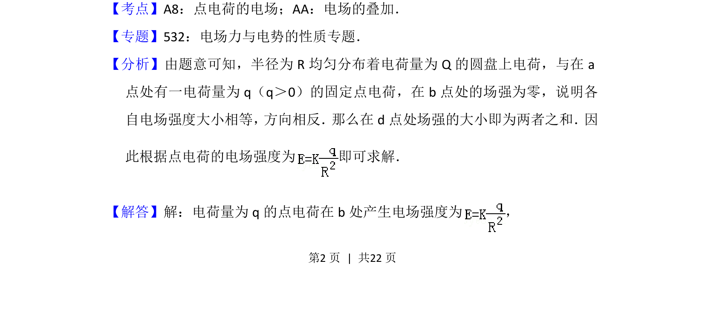
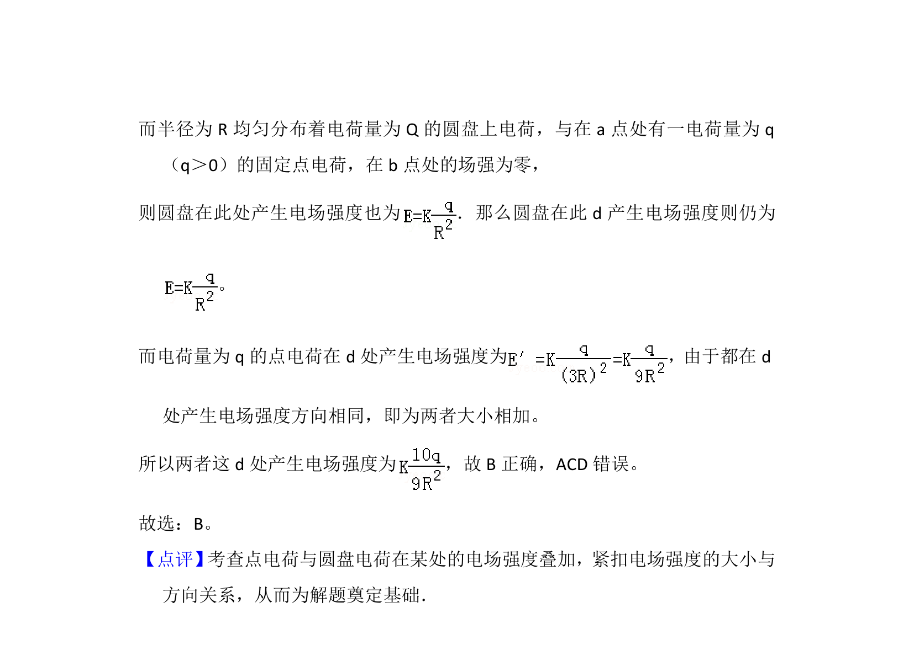

## 题面

## 摘要

圆盘电荷与点电荷在轴线上叠加电场，已知b点合场强为零，求d点场强。

## 关联考点

- [[点电荷的电场]]
- [[电场的叠加]]
- [[834-对称性|对称性]]

## 答案与解析

> 📄 原 PDF 第 2 页：`素材/真题/湖南/2008-2024·（湖南）物理高考真题/2013年高考物理试卷（新课标Ⅰ）（解析卷）.pdf`

<!-- 题干文本-start -->
## 题干文本
2． （6分） 如图，一半径为R的圆盘上均匀分布着电荷量为Q的电荷，在垂直于
圆盘且过圆心c的轴线上有a、b、d三个点，a和b、b和c、c和d间的距离
均为R，在a点处有一电荷量为q（q＞0） 的固定点电荷．已知b点处的场强
为零，则d点处场强的大小为（k为静电力常量） （　　）
A．B．C．D．
<!-- 题干文本-end -->

<!-- 解析文本-start -->
## 解析文本
【考点】A8：点电荷的电场；AA：电场的叠加．菁优网版权所有
【专题】532：电场力与电势的性质专题．
【分析】由题意可知，半径为R均匀分布着电荷量为Q的圆盘上电荷，与在a
点处有一电荷量为q（q＞0）的固定点电荷，在b点处的场强为零，说明各
自电场强度大小相等， 方向相反． 那么在d点处场强的大小即为两者之和． 因
此根据点电荷的电场强度为 即可求解．
【解答】解：电荷量为q的点电荷在b处产生电场强度为 ，
<!-- 解析文本-end -->
