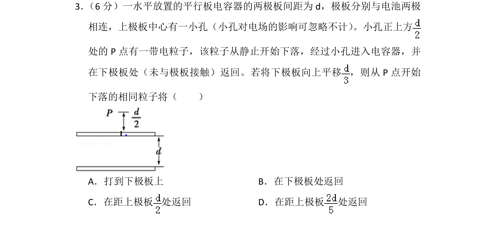
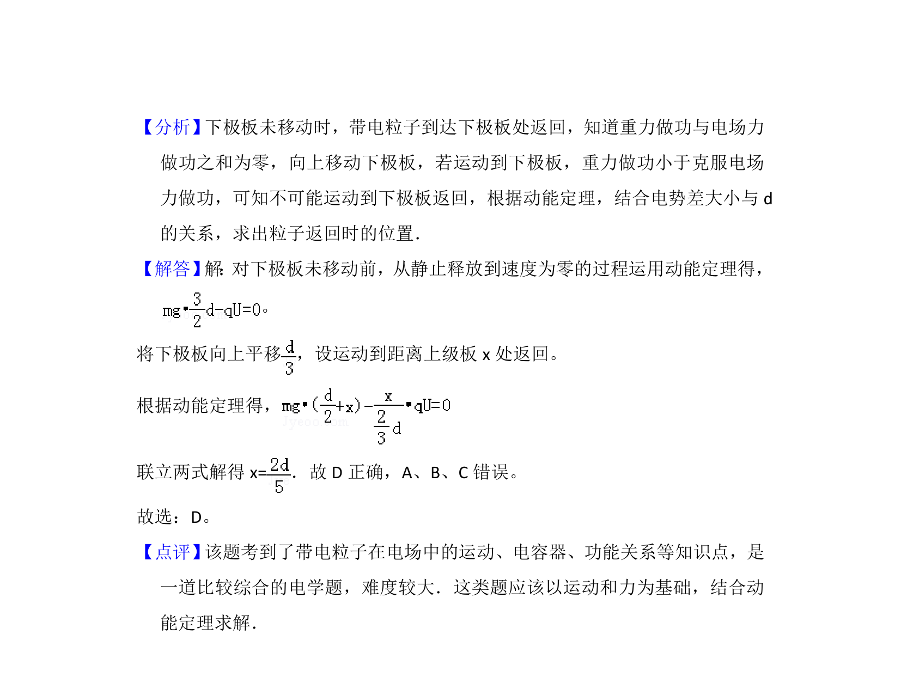

## 题面

## 摘要

带电粒子在平行板电容器中的运动，结合电容器的动态变化，判断粒子下落返回位置。

## 关联考点

- [[468-带电粒子在匀强电场中的运动|带电粒子在匀强电场中的运动]]
- [[865-电容器的动态分析|电容器的动态分析]]

## 答案与解析

> 📄 原 PDF 第 3 页：`素材/真题/湖南/2008-2024·（湖南）物理高考真题/2013年高考物理试卷（新课标Ⅰ）（解析卷）.pdf`
