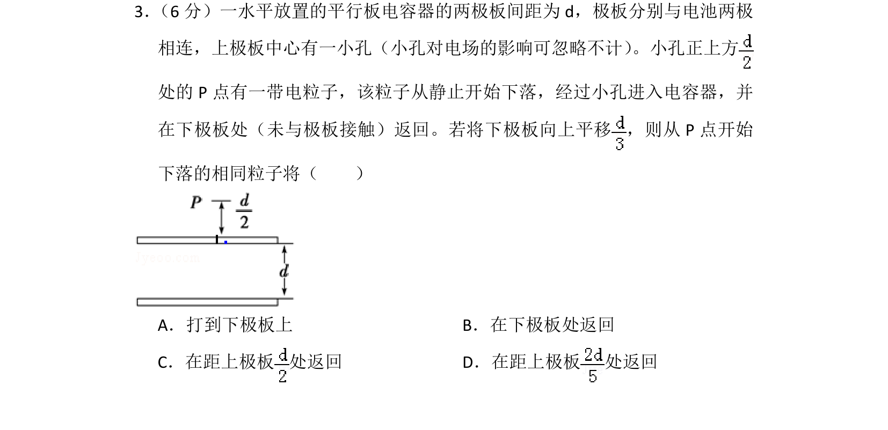
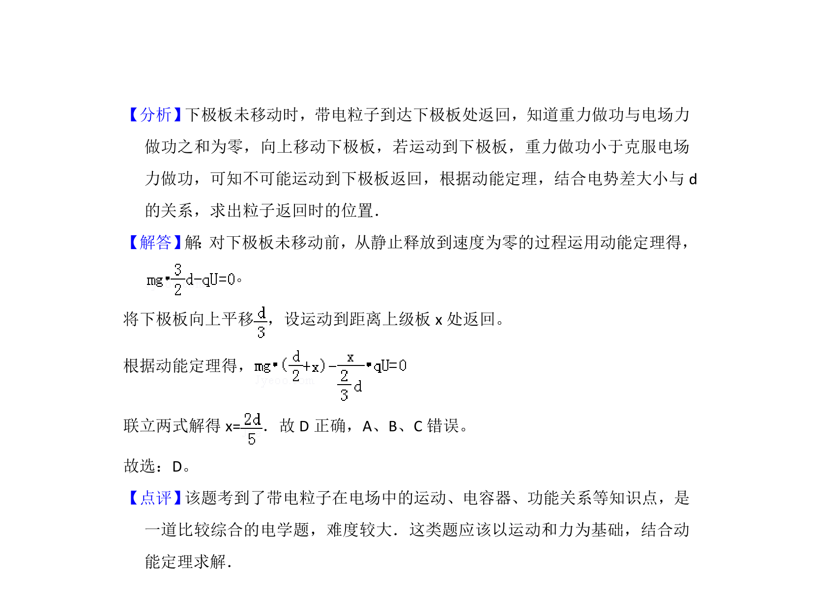

## 题面

## 摘要

带电粒子在平行板电容器中的运动，结合电容器的动态变化，判断粒子下落返回位置。

## 关联考点

- [[468-带电粒子在匀强电场中的运动|带电粒子在匀强电场中的运动]]
- [[865-电容器的动态分析|电容器的动态分析]]

## 答案与解析

> 📄 原 PDF 第 3 页：`素材/真题/湖南/2008-2024·（湖南）物理高考真题/2013年高考物理试卷（新课标Ⅰ）（解析卷）.pdf`

<!-- 题干文本-start -->
## 题干文本
3． （6分）一水平放置的平行板电容器的两极板间距为d，极板分别与电池两极
相连，上极板中心有一小孔（小孔对电场的影响可忽略不计） 。小孔正上方
处的P点有一带电粒子，该粒子从静止开始下落，经过小孔进入电容器，并
在下极板处（未与极板接触）返回。若将下极板向上平移 ，则从P点开始
下落的相同粒子将（　　）
A．打到下极板上B．在下极板处返回
C．在距上极板 处返回D．在距上极板 处返回
<!-- 题干文本-end -->

<!-- 解析文本-start -->
## 解析文本
【考点】AK：带电粒子在匀强电场中的运动；AS：电容器的动态分析．菁优网版权所有
【专题】533：电容器专题．
<!-- 解析文本-end -->
