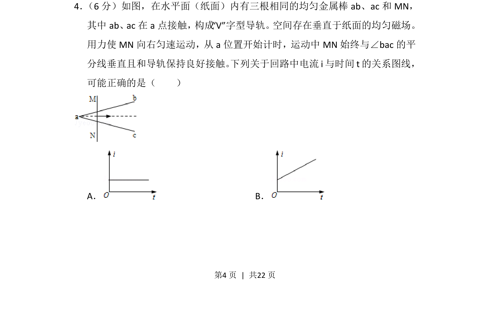
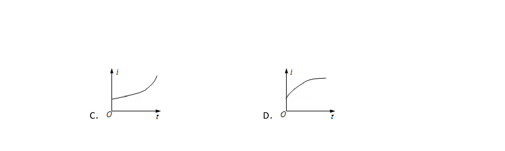
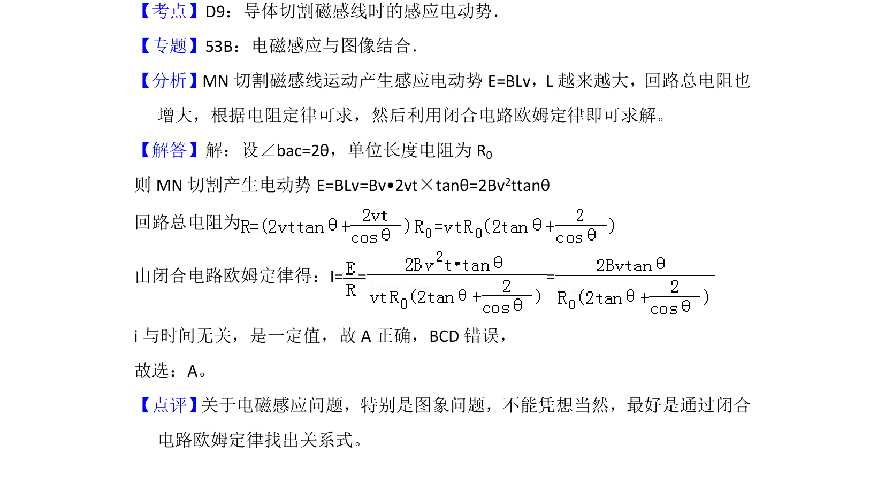

## 题面

## 摘要

电磁感应中动生电动势与电路电阻随时间变化的动态分析，判断感应电流的恒定与否。

## 关联考点

- [[175-电磁感应|电磁感应]]
- [[538-动生电动势|动生电动势]]
- [[332-闭合电路欧姆定律|闭合电路欧姆定律]]
- [[318-电阻定律|电阻定律]]

## 答案与解析

> 📄 原 PDF 第 4 页：`素材/真题/湖南/2008-2024·（湖南）物理高考真题/2013年高考物理试卷（新课标Ⅰ）（解析卷）.pdf`
