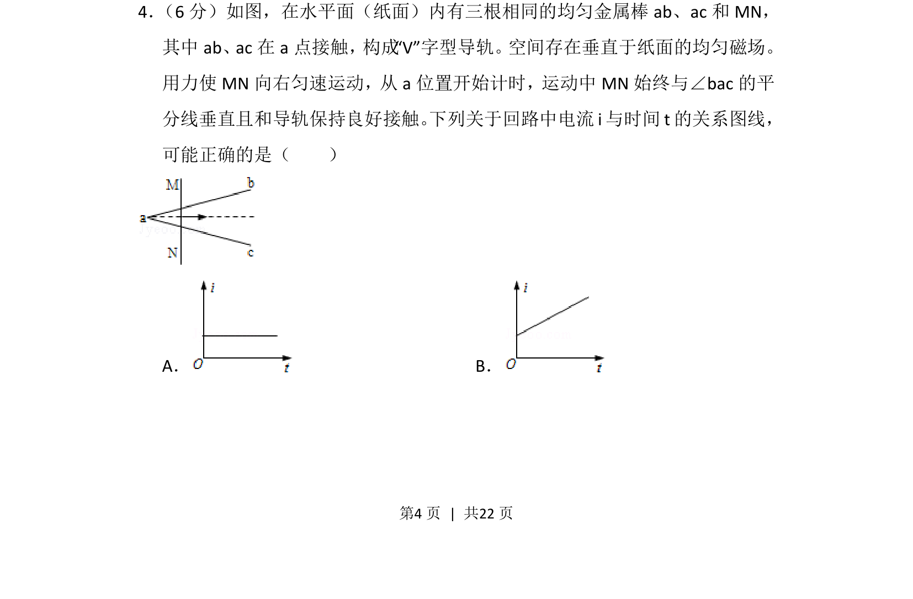
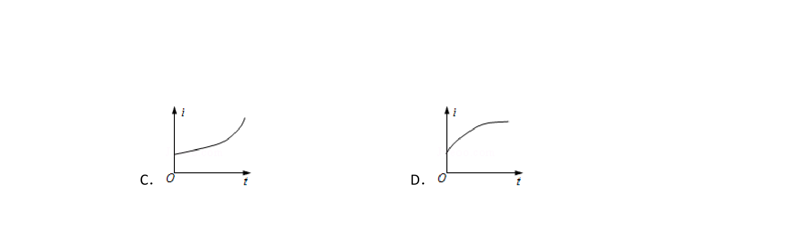
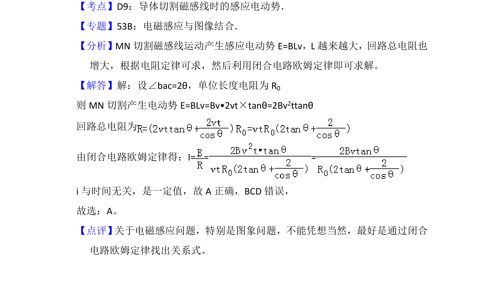

## 题面

## 摘要

电磁感应中动生电动势与电路电阻随时间变化的动态分析，判断感应电流的恒定与否。

## 关联考点

- [[175-电磁感应|电磁感应]]
- [[538-动生电动势|动生电动势]]
- [[332-闭合电路欧姆定律|闭合电路欧姆定律]]
- [[318-电阻定律|电阻定律]]

## 答案与解析

> 📄 原 PDF 第 4 页：`素材/真题/湖南/2008-2024·（湖南）物理高考真题/2013年高考物理试卷（新课标Ⅰ）（解析卷）.pdf`

<!-- 题干文本-start -->
## 题干文本
4． （6分）如图，在水平面（纸面）内有三根相同的均匀金属棒ab、ac和MN，
其中ab、ac在a点接触， 构成“V”字型导轨。 空间存在垂直于纸面的均匀磁场。
用力使MN向右匀速运动，从a位置开始计时，运动中MN始终与∠bac的平
分线垂直且和导轨保持良好接触。 下列关于回路中电流i与时间t的关系图线，
可能正确的是（　　）
A．B．
<!-- 题干文本-end -->

<!-- 解析文本-start -->
## 解析文本

<!-- 解析文本-end -->
