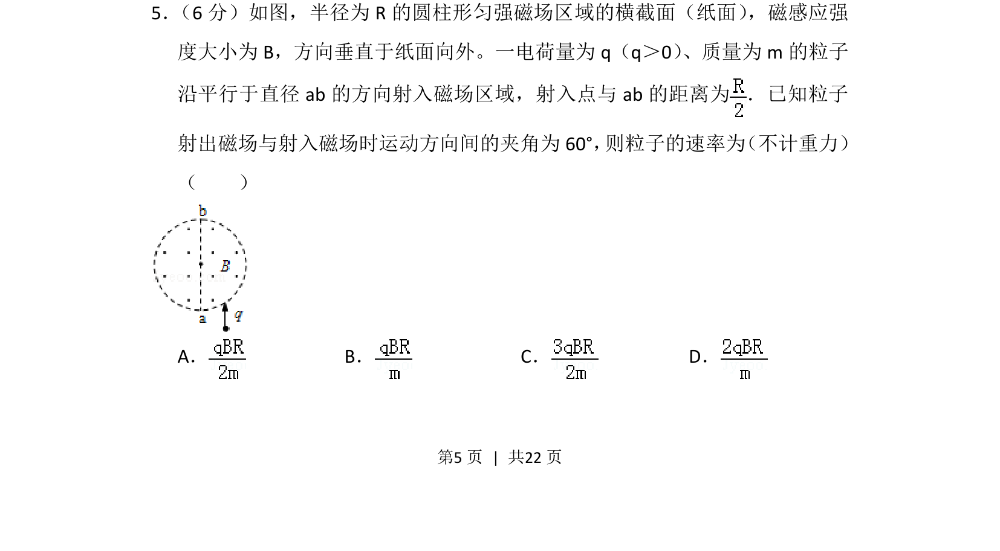
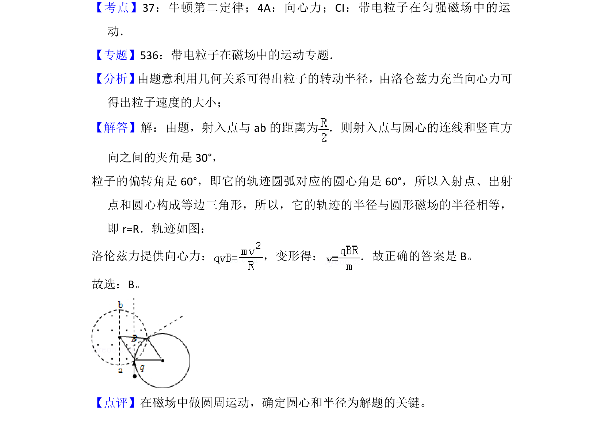

## 题面

## 摘要

带电粒子在圆形匀强磁场中偏转，由入射位置和偏转角求速率。

## 关联考点

- [[595-带电粒子在匀强磁场中的运动|带电粒子在匀强磁场中的运动]]
- [[304-洛伦兹力|洛伦兹力]]
- [[256-向心力|向心力]]
- [[456-几何关系|几何关系]]

## 答案与解析

> 📄 原 PDF 第 5 页：`素材/真题/湖南/2008-2024·（湖南）物理高考真题/2013年高考物理试卷（新课标Ⅰ）（解析卷）.pdf`
