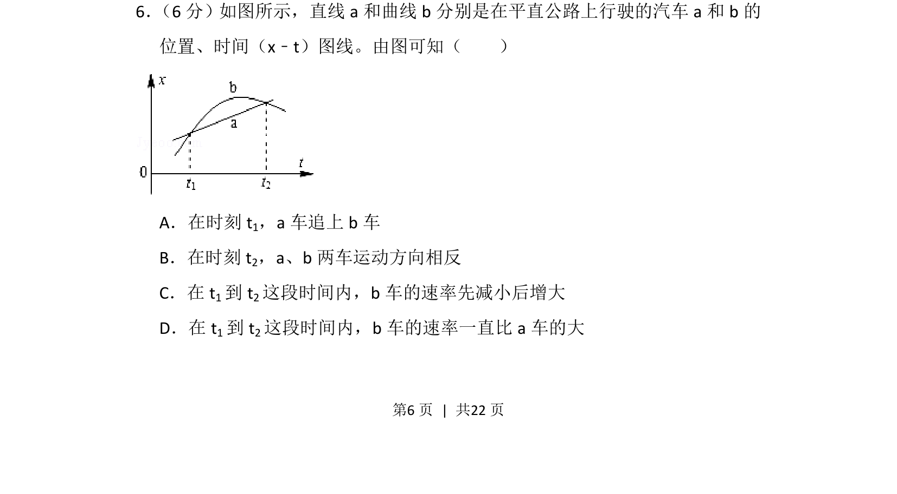
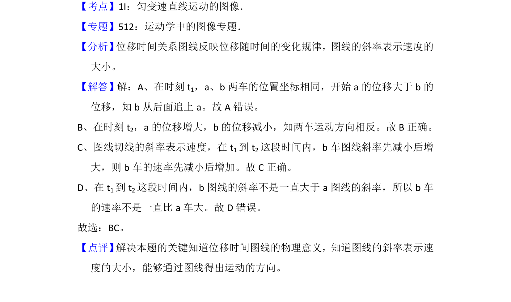

## 题面

## 摘要

考查x-t图像中速度方向、追及条件及速率变化分析。

## 关联考点

- [[513-位移时间图像分析|x-t图像]]
- [[045-速度|速度]]
- [[822-追及相遇问题|追及问题]]
- [[速率]]

## 答案与解析

> 📄 原 PDF 第 6 页：`素材/真题/湖南/2008-2024·（湖南）物理高考真题/2013年高考物理试卷（新课标Ⅰ）（解析卷）.pdf`
