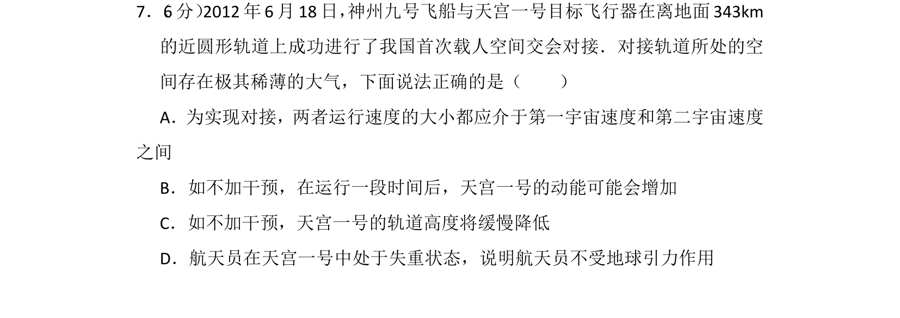
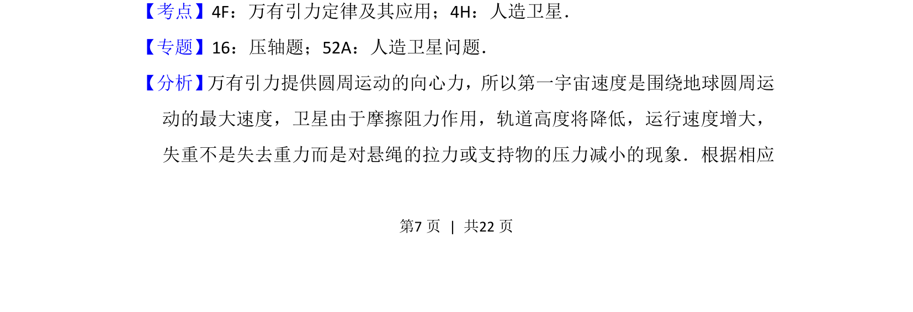
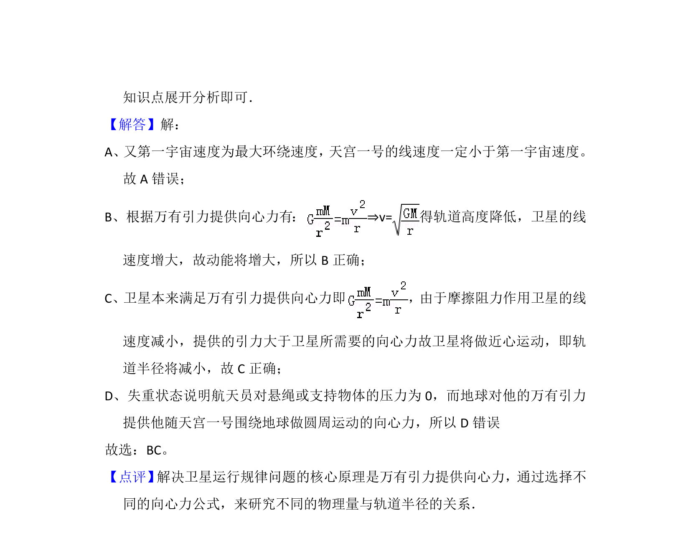

## 题面

## 摘要

万有引力定律与人造卫星轨道、动能变化及失重现象分析

## 关联考点

- [[246-万有引力定律|万有引力定律]]
- [[836-人造卫星|人造卫星]]
- [[281-第一宇宙速度|第一宇宙速度]]
- [[失重]]

## 答案与解析

> 📄 原 PDF 第 7 页：`素材/真题/湖南/2008-2024·（湖南）物理高考真题/2013年高考物理试卷（新课标Ⅰ）（解析卷）.pdf`
