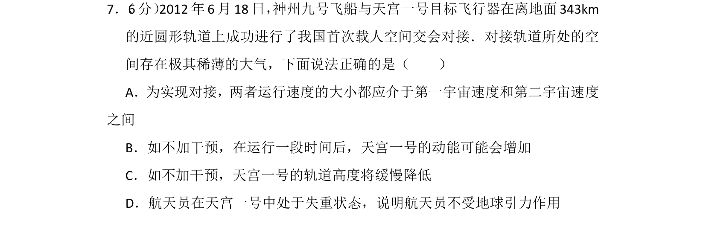
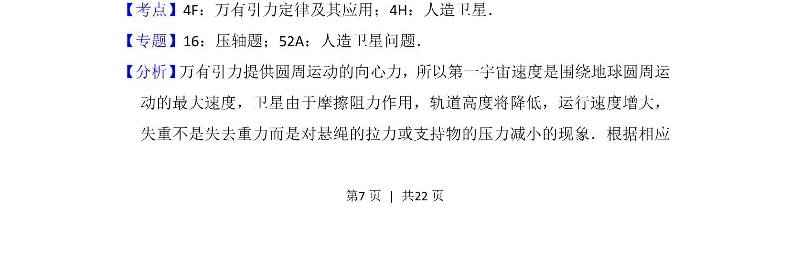
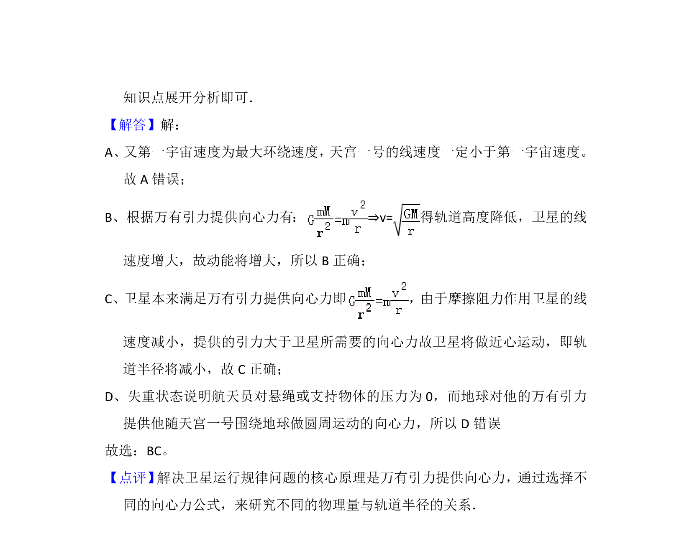

## 题面

## 摘要

万有引力定律与人造卫星轨道、动能变化及失重现象分析

## 关联考点

- [[246-万有引力定律|万有引力定律]]
- [[836-人造卫星|人造卫星]]
- [[281-第一宇宙速度|第一宇宙速度]]
- [[失重]]

## 答案与解析

> 📄 原 PDF 第 7 页：`素材/真题/湖南/2008-2024·（湖南）物理高考真题/2013年高考物理试卷（新课标Ⅰ）（解析卷）.pdf`

<!-- 题干文本-start -->
## 题干文本
7． （6分）2012年6月18日， 神州九号飞船与天宫一号目标飞行器在离地面343km
的近圆形轨道上成功进行了我国首次载人空间交会对接．对接轨道所处的空
间存在极其稀薄的大气，下面说法正确的是（　　）
A．为实现对接，两者运行速度的大小都应介于第一宇宙速度和第二宇宙速度
之间
B．如不加干预，在运行一段时间后，天宫一号的动能可能会增加
C．如不加干预，天宫一号的轨道高度将缓慢降低
D．航天员在天宫一号中处于失重状态，说明航天员不受地球引力作用
<!-- 题干文本-end -->

<!-- 解析文本-start -->
## 解析文本
【考点】4F：万有引力定律及其应用；4H：人造卫星．菁优网版权所有
【专题】16：压轴题；52A：人造卫星问题．
【分析】 万有引力提供圆周运动的向心力，所以第一宇宙速度是围绕地球圆周运
动的最大速度，卫星由于摩擦阻力作用，轨道高度将降低，运行速度增大，
失重不是失去重力而是对悬绳的拉力或支持物的压力减小的现象．根据相应
<!-- 解析文本-end -->
