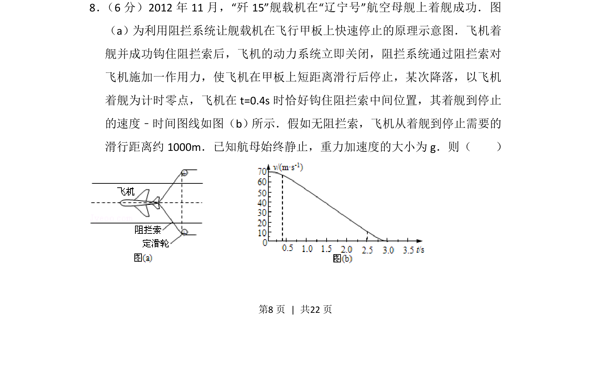
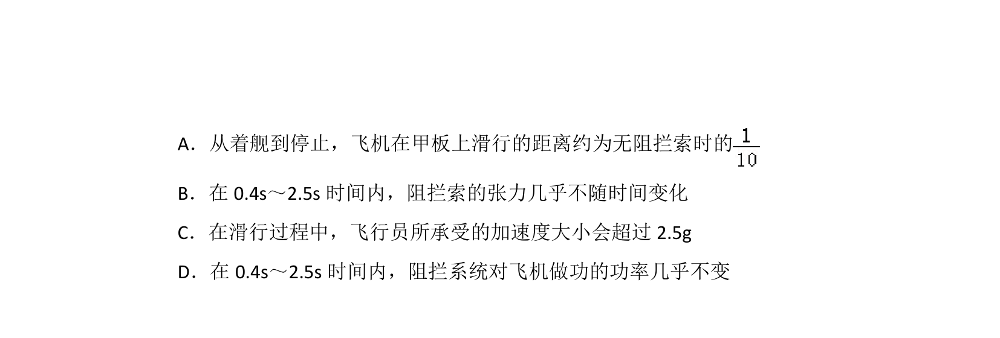
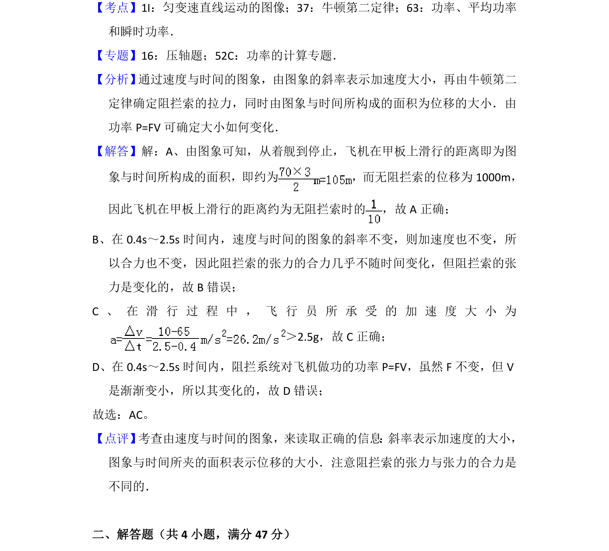

## 题面

## 摘要

考查舰载机在阻拦索作用下的减速运动，结合v-t图像分析运动与力的问题。

## 关联考点

- [[497-v-t图像|v-t图像]]
- [[215-匀变速直线运动|匀变速直线运动]]
- [[229-牛顿第二定律|牛顿第二定律]]
- [[733-运动学公式|运动学公式]]

## 答案与解析

> 📄 原 PDF 第 8 页：`素材/真题/湖南/2008-2024·（湖南）物理高考真题/2013年高考物理试卷（新课标Ⅰ）（解析卷）.pdf`
