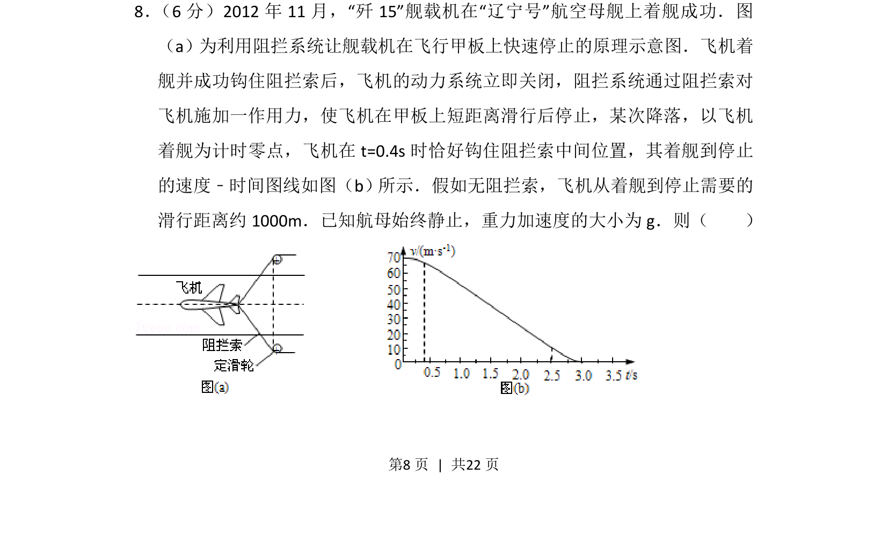
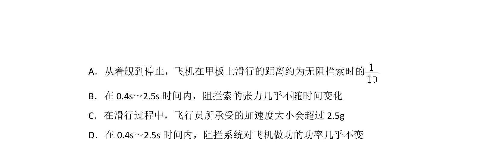
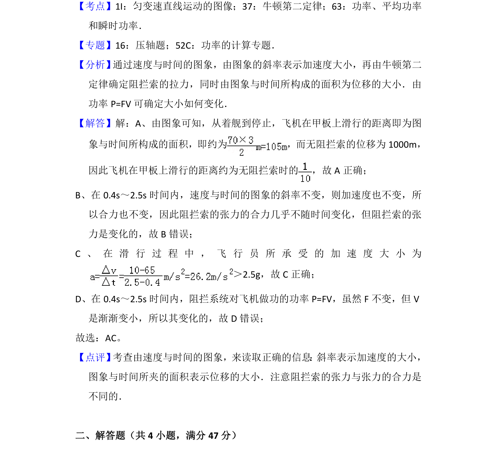

## 题面

## 摘要

考查舰载机在阻拦索作用下的减速运动，结合v-t图像分析运动与力的问题。

## 关联考点

- [[497-v-t图像|v-t图像]]
- [[215-匀变速直线运动|匀变速直线运动]]
- [[229-牛顿第二定律|牛顿第二定律]]
- [[733-运动学公式|运动学公式]]

## 答案与解析

> 📄 原 PDF 第 8 页：`素材/真题/湖南/2008-2024·（湖南）物理高考真题/2013年高考物理试卷（新课标Ⅰ）（解析卷）.pdf`

<!-- 题干文本-start -->
## 题干文本
8． （6分）2012年11月，“歼15”舰载机在“辽宁号”航空母舰上着舰成功．图
（a）为利用阻拦系统让舰载机在飞行甲板上快速停止的原理示意图．飞机着
舰并成功钩住阻拦索后，飞机的动力系统立即关闭，阻拦系统通过阻拦索对
飞机施加一作用力，使飞机在甲板上短距离滑行后停止，某次降落，以飞机
着舰为计时零点，飞机在t=0.4s时恰好钩住阻拦索中间位置，其着舰到停止
的速度﹣时间图线如图（b）所示．假如无阻拦索，飞机从着舰到停止需要的
滑行距离约1000m．已知航母始终静止，重力加速度的大小为g．则（　　）
<!-- 题干文本-end -->

<!-- 解析文本-start -->
## 解析文本

<!-- 解析文本-end -->
