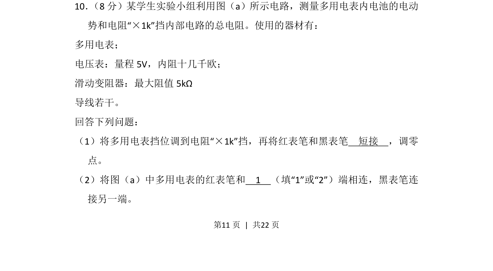
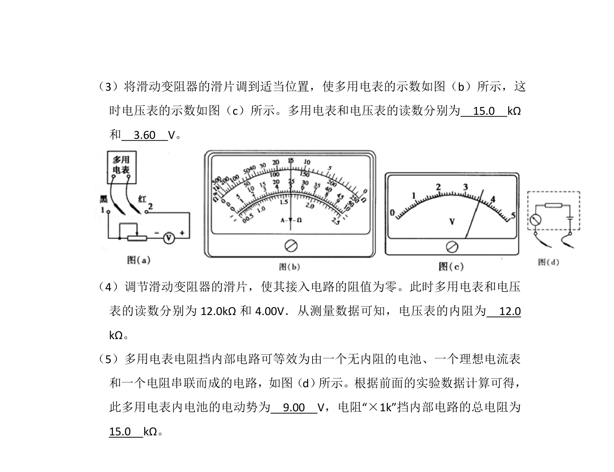
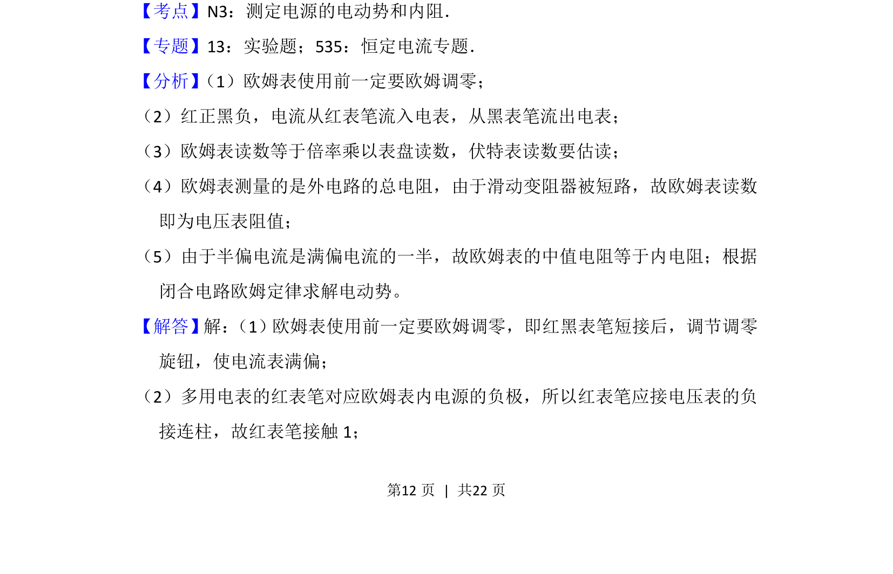
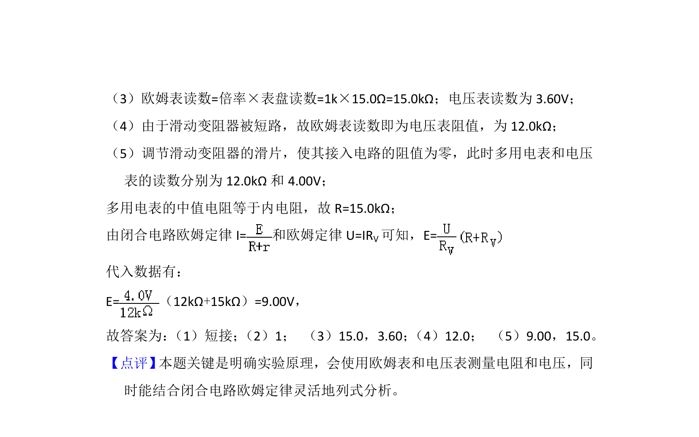

## 题面

## 摘要

测量多用电表内电池电动势和“×1k”挡内部电路总电阻的实验操作与连线判断。

## 关联考点

- [[576-多用电表使用|多用电表使用]]
- [[实验电路连接]]
- [[631-欧姆调零|欧姆调零]]
- [[电动势测量]]

## 答案与解析

> 📄 原 PDF 第 11 页：`素材/真题/湖南/2008-2024·（湖南）物理高考真题/2013年高考物理试卷（新课标Ⅰ）（解析卷）.pdf`
