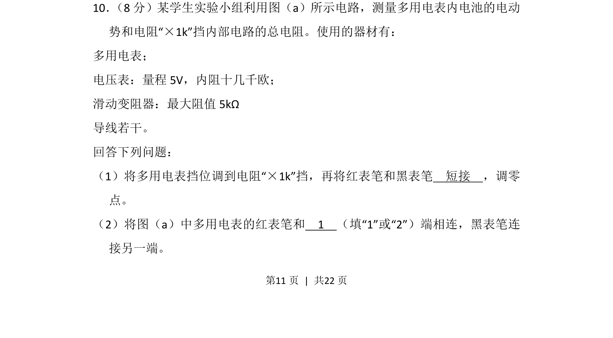
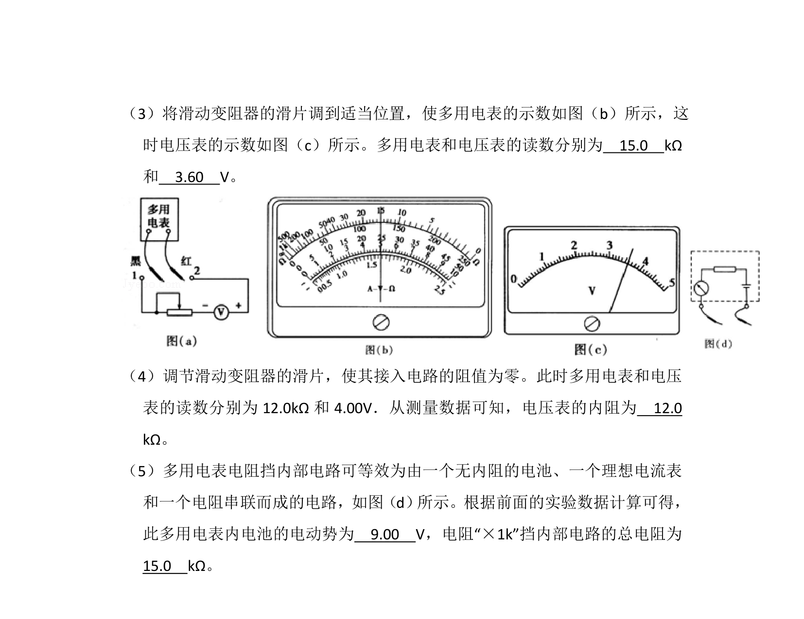
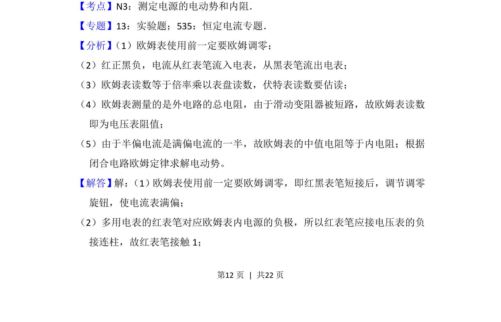
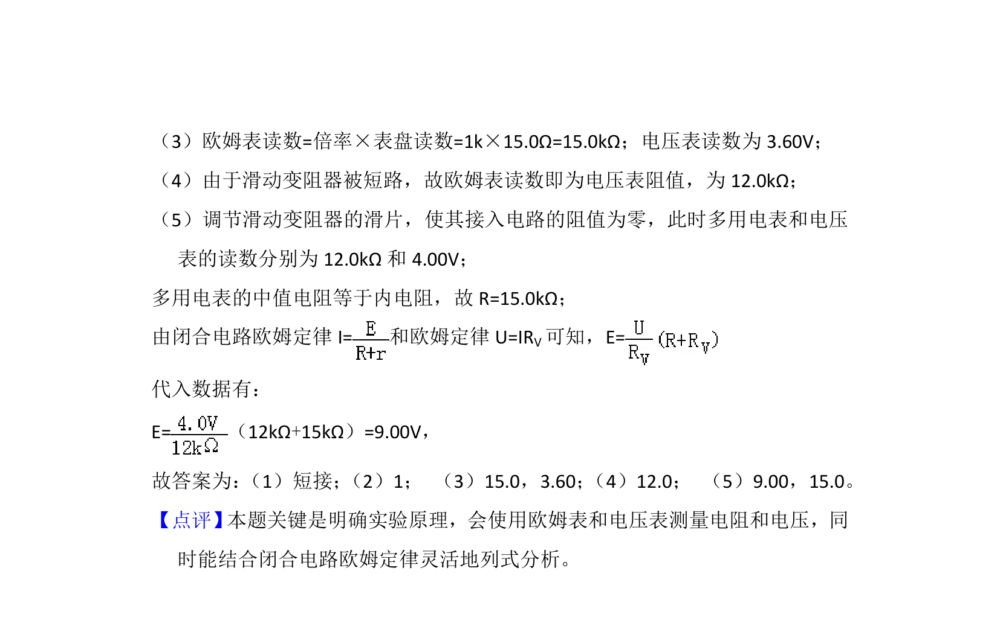

## 题面

## 摘要

测量多用电表内电池电动势和“×1k”挡内部电路总电阻的实验操作与连线判断。

## 关联考点

- [[784-多用电表的使用|多用电表使用]]
- [[实验电路连接]]
- [[631-欧姆调零|欧姆调零]]
- [[电动势测量]]

## 答案与解析

> 📄 原 PDF 第 11 页：`素材/真题/湖南/2008-2024·（湖南）物理高考真题/2013年高考物理试卷（新课标Ⅰ）（解析卷）.pdf`

<!-- 题干文本-start -->
## 题干文本
10． （8分）某学生实验小组利用图（a）所示电路，测量多用电表内电池的电动
势和电阻“×1k”挡内部电路的总电阻。使用的器材有：
多用电表；
电压表：量程5V，内阻十几千欧；
滑动变阻器：最大阻值5kΩ
导线若干。
回答下列问题：
（1）将多用电表挡位调到电阻“×1k”挡，再将红表笔和黑表笔　短接　，调零
点。
（2）将图（a）中多用电表的红表笔和　1　（填“1”或“2”）端相连，黑表笔连
接另一端。
<!-- 题干文本-end -->

<!-- 解析文本-start -->
## 解析文本

<!-- 解析文本-end -->
