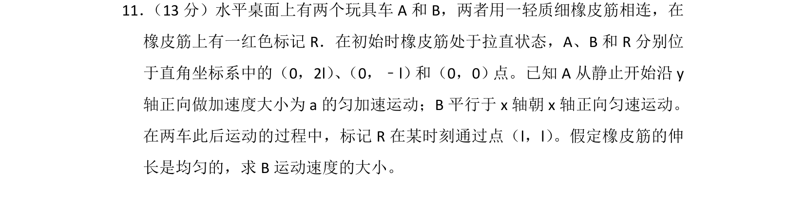
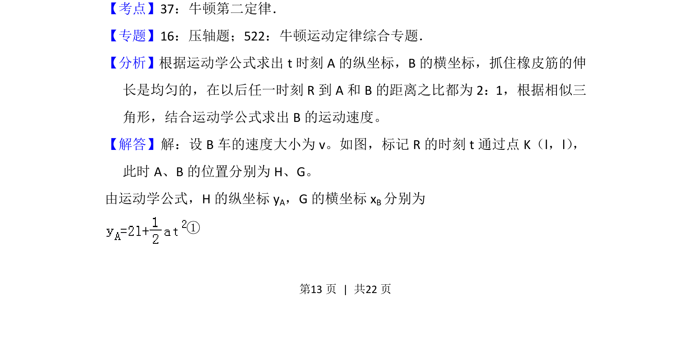
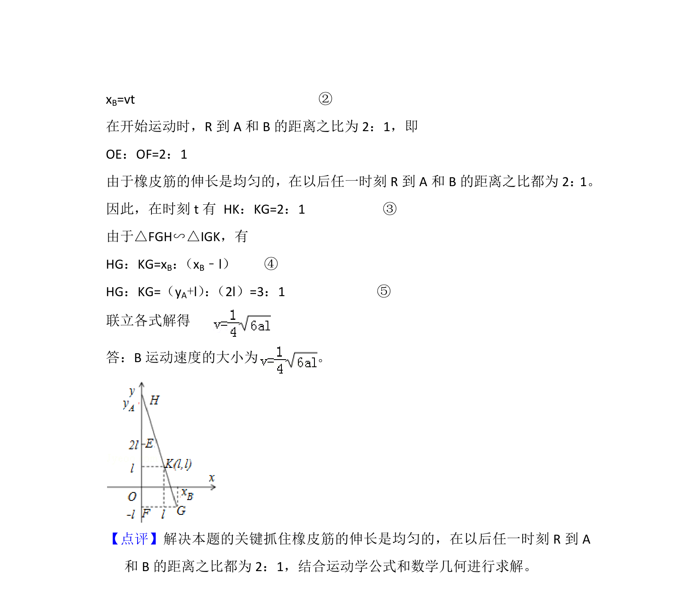

## 题面

## 摘要

两个玩具车通过橡皮筋相连，标记点R运动分析求B车速度，涉及匀变速与匀速的几何关系。

## 关联考点

- [[215-匀变速直线运动|匀变速直线运动]]
- [[229-牛顿第二定律|牛顿第二定律]]
- [[288-运动的合成与分解|运动的合成与分解]]

## 答案与解析

> 📄 原 PDF 第 13 页：`素材/真题/湖南/2008-2024·（湖南）物理高考真题/2013年高考物理试卷（新课标Ⅰ）（解析卷）.pdf`
