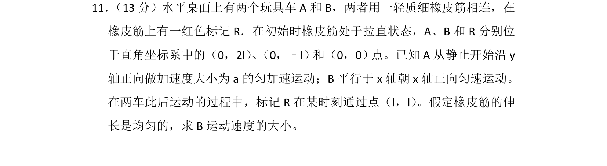
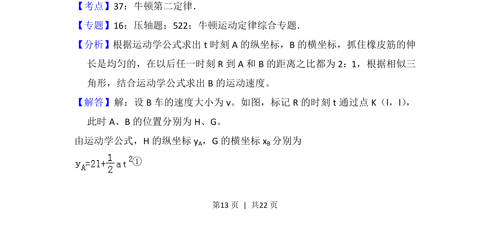
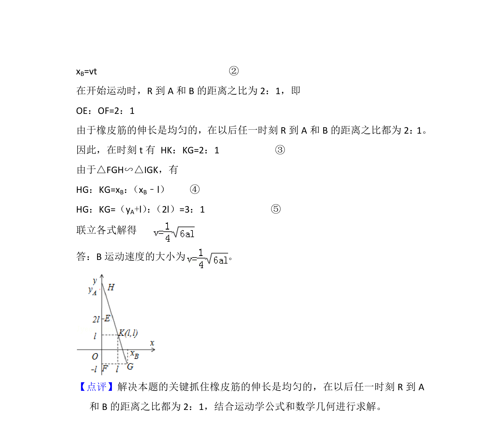

## 题面

## 摘要

两个玩具车通过橡皮筋相连，标记点R运动分析求B车速度，涉及匀变速与匀速的几何关系。

## 关联考点

- [[215-匀变速直线运动|匀变速直线运动]]
- [[229-牛顿第二定律|牛顿第二定律]]
- [[288-运动的合成与分解|运动的合成与分解]]

## 答案与解析

> 📄 原 PDF 第 13 页：`素材/真题/湖南/2008-2024·（湖南）物理高考真题/2013年高考物理试卷（新课标Ⅰ）（解析卷）.pdf`

<!-- 题干文本-start -->
## 题干文本
11． （13分）水平桌面上有两个玩具车A和B，两者用一轻质细橡皮筋相连，在
橡皮筋上有一红色标记R．在初始时橡皮筋处于拉直状态，A、B和R分别位
于直角坐标系中的（0，2l） 、 （0，﹣l）和（0，0）点。已知A从静止开始沿y
轴正向做加速度大小为a的匀加速运动；B平行于x轴朝x轴正向匀速运动。
在两车此后运动的过程中，标记R在某时刻通过点（l，l） 。假定橡皮筋的伸
长是均匀的，求B运动速度的大小。
<!-- 题干文本-end -->

<!-- 解析文本-start -->
## 解析文本
【考点】37：牛顿第二定律．菁优网版权所有
【专题】16：压轴题；522：牛顿运动定律综合专题．
【分析】根据运动学公式求出t时刻A的纵坐标，B的横坐标，抓住橡皮筋的伸
长是均匀的，在以后任一时刻R到A和B的距离之比都为2：1，根据相似三
角形，结合运动学公式求出B的运动速度。
【解答】解：设B车的速度大小为v。如图，标记R的时刻t通过点K（l，l） ，
此时A、B的位置分别为H、G。
由运动学公式，H的纵坐标y A，G的横坐标x B分别为
①
<!-- 解析文本-end -->
