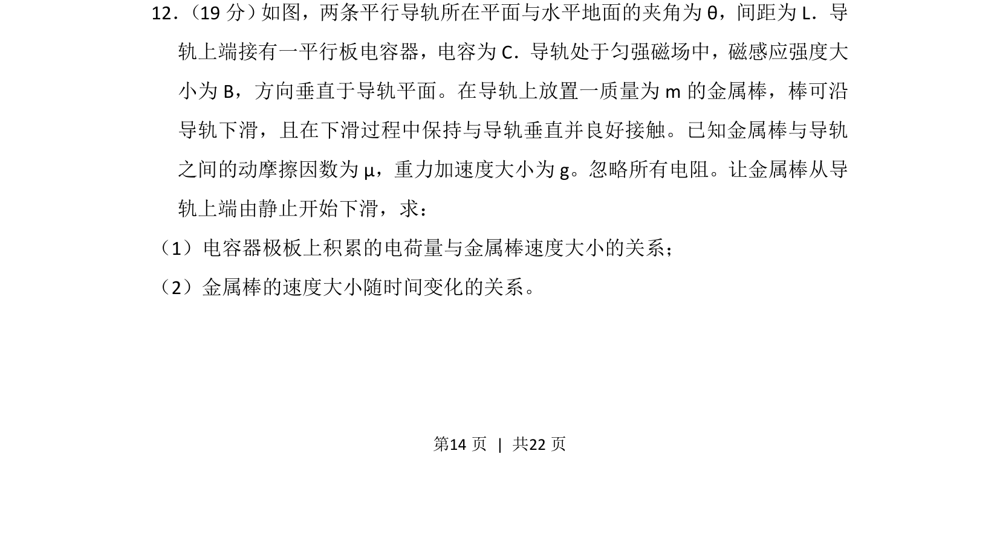
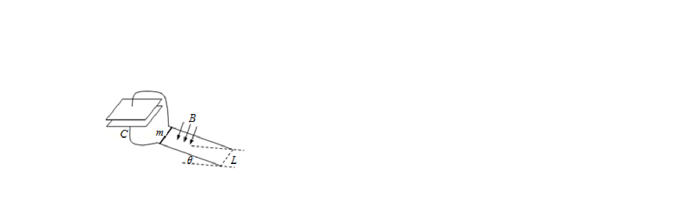
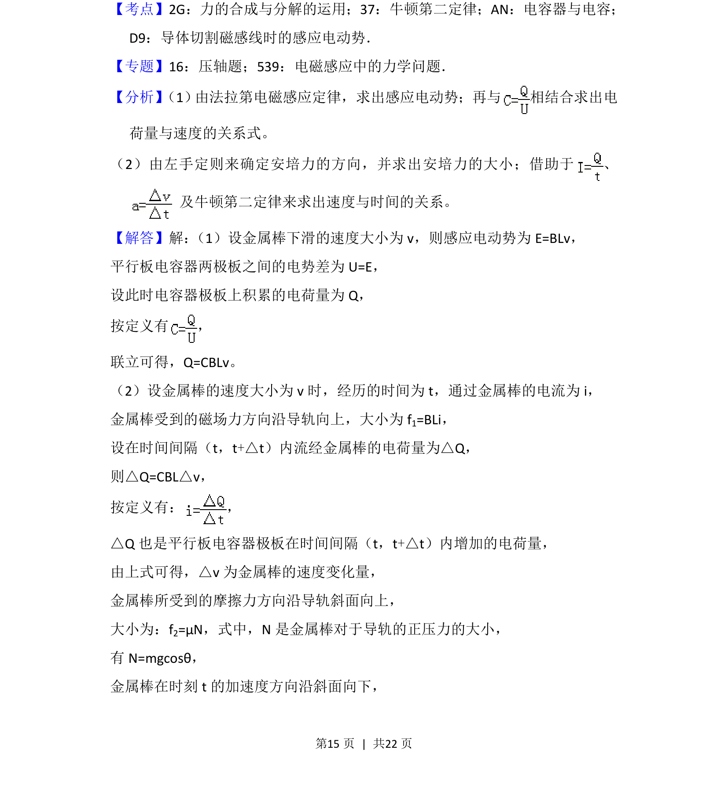
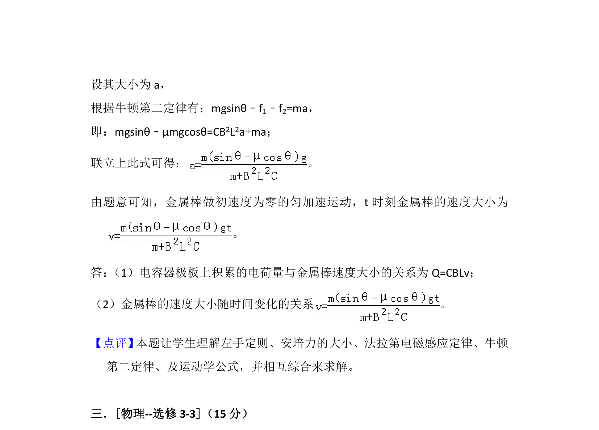

## 题面

## 摘要

金属棒在倾斜导轨匀强磁场中下滑，连接电容器，分析电荷与速度关系及速度随时间变化规律。

## 关联考点

- [[175-电磁感应|电磁感应]]
- [[312-电容|电容]]
- [[1175-牛顿运动定律|牛顿运动定律]]
- [[188-磁场对通电导体的作用|安培力]]

## 答案与解析

> 📄 原 PDF 第 14 页：`素材/真题/湖南/2008-2024·（湖南）物理高考真题/2013年高考物理试卷（新课标Ⅰ）（解析卷）.pdf`
