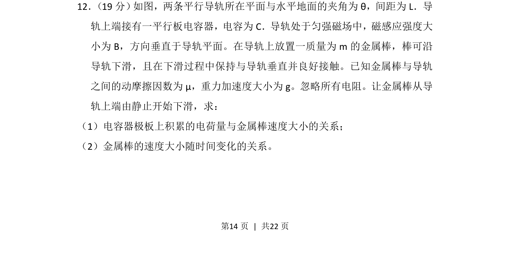
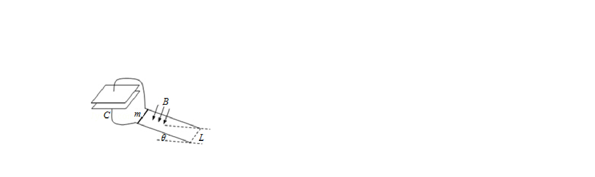
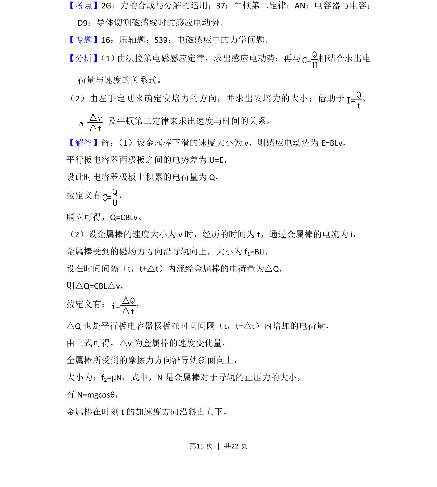
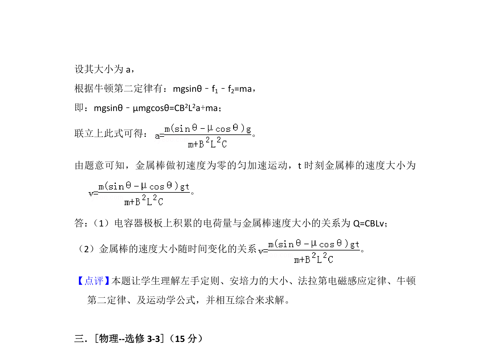

## 题面

## 摘要

金属棒在倾斜导轨匀强磁场中下滑，连接电容器，分析电荷与速度关系及速度随时间变化规律。

## 关联考点

- [[175-电磁感应|电磁感应]]
- [[312-电容|电容]]
- [[1175-牛顿运动定律|牛顿运动定律]]
- [[188-磁场对通电导体的作用|安培力]]

## 答案与解析

> 📄 原 PDF 第 14 页：`素材/真题/湖南/2008-2024·（湖南）物理高考真题/2013年高考物理试卷（新课标Ⅰ）（解析卷）.pdf`

<!-- 题干文本-start -->
## 题干文本
12． （19分） 如图，两条平行导轨所在平面与水平地面的夹角为θ，间距为L．导
轨上端接有一平行板电容器，电容为C．导轨处于匀强磁场中，磁感应强度大
小为B，方向垂直于导轨平面。在导轨上放置一质量为m的金属棒，棒可沿
导轨下滑，且在下滑过程中保持与导轨垂直并良好接触。已知金属棒与导轨
之间的动摩擦因数为μ，重力加速度大小为g。忽略所有电阻。让金属棒从导
轨上端由静止开始下滑，求：
（1）电容器极板上积累的电荷量与金属棒速度大小的关系；
（2）金属棒的速度大小随时间变化的关系。
<!-- 题干文本-end -->

<!-- 解析文本-start -->
## 解析文本

<!-- 解析文本-end -->
