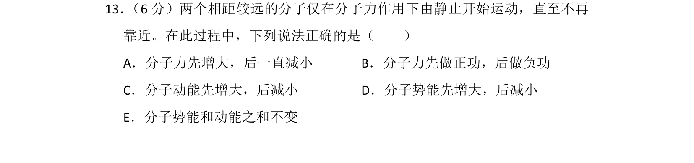
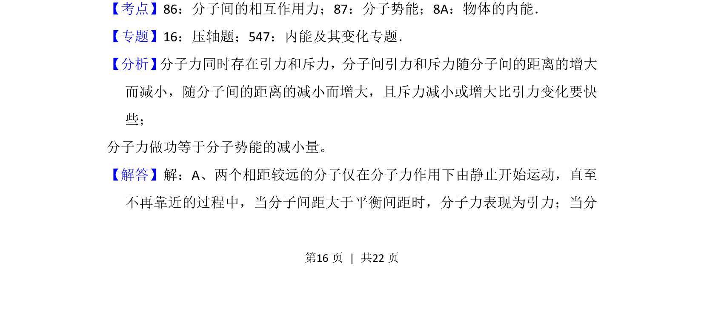
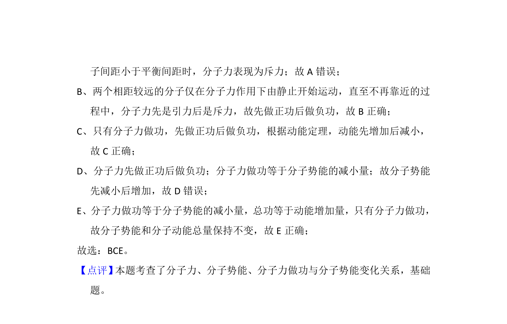

## 题面

## 摘要

分子仅在分子力作用下运动，分析分子力、动能、势能变化及能量守恒

## 关联考点

- [[841-分子间的相互作用力|分子间的相互作用力]]
- [[867-分子势能|分子势能]]
- [[分子动能]]
- [[197-能量守恒定律|能量守恒]]

## 答案与解析

> 📄 原 PDF 第 16 页：`素材/真题/湖南/2008-2024·（湖南）物理高考真题/2013年高考物理试卷（新课标Ⅰ）（解析卷）.pdf`
