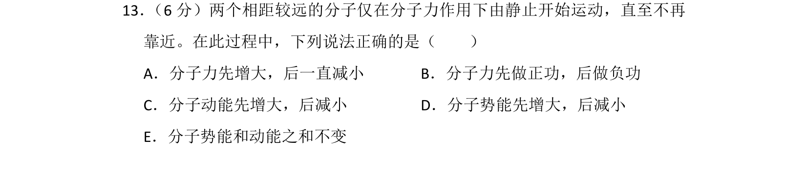
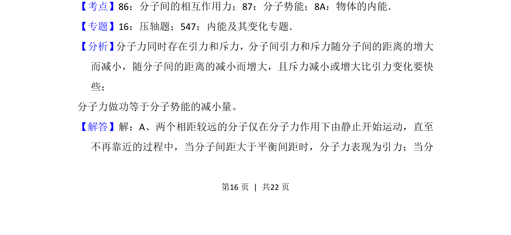
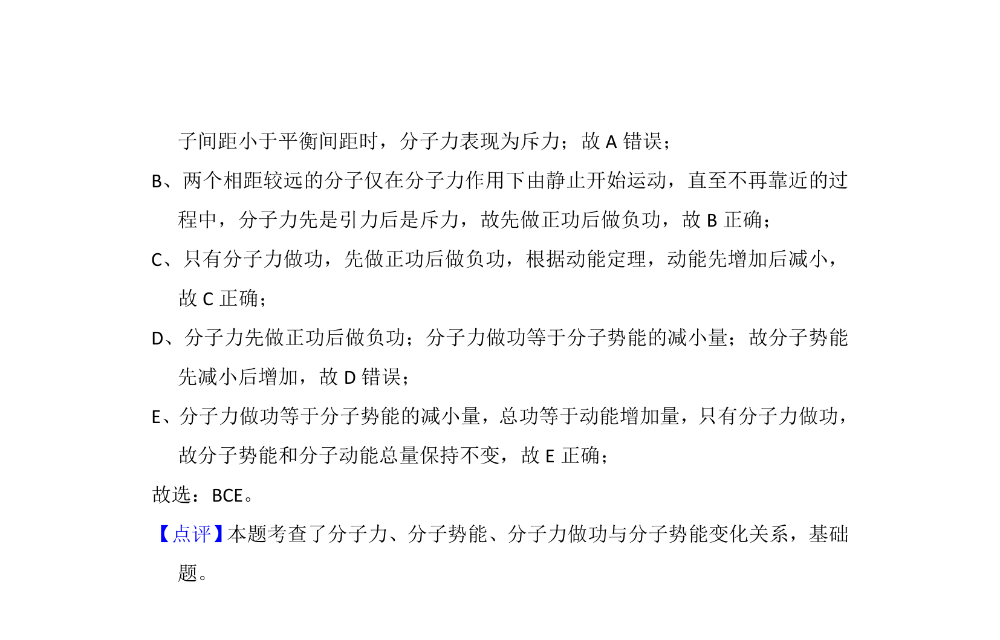

## 题面

## 摘要

分子仅在分子力作用下运动，分析分子力、动能、势能变化及能量守恒

## 关联考点

- [[841-分子间的相互作用力|分子间的相互作用力]]
- [[867-分子势能|分子势能]]
- [[分子动能]]
- [[197-能量守恒定律|能量守恒]]

## 答案与解析

> 📄 原 PDF 第 16 页：`素材/真题/湖南/2008-2024·（湖南）物理高考真题/2013年高考物理试卷（新课标Ⅰ）（解析卷）.pdf`

<!-- 题干文本-start -->
## 题干文本
13． （6分）两个相距较远的分子仅在分子力作用下由静止开始运动，直至不再
靠近。在此过程中，下列说法正确的是（　　）
A．分子力先增大，后一直减小B．分子力先做正功，后做负功
C．分子动能先增大，后减小D．分子势能先增大，后减小
E．分子势能和动能之和不变
<!-- 题干文本-end -->

<!-- 解析文本-start -->
## 解析文本
【考点】86：分子间的相互作用力；87：分子势能；8A：物体的内能．菁优网版权所有
【专题】16：压轴题；547：内能及其变化专题．
【分析】 分子力同时存在引力和斥力，分子间引力和斥力随分子间的距离的增大
而减小，随分子间的距离的减小而增大，且斥力减小或增大比引力变化要快
些；
分子力做功等于分子势能的减小量。
【解答】解：A、两个相距较远的分子仅在分子力作用下由静止开始运动，直至
不再靠近的过程中，当分子间距大于平衡间距时，分子力表现为引力；当分
<!-- 解析文本-end -->
