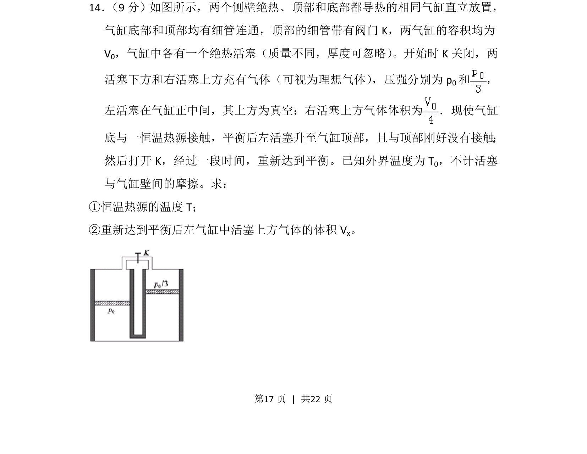
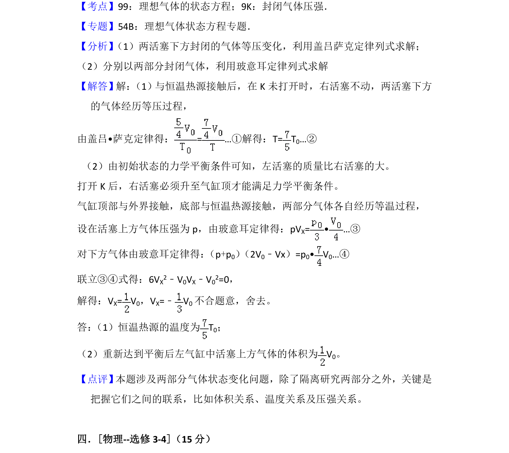

## 题面

## 摘要

两个气缸通过阀门连通，涉及理想气体等温、等压变化及活塞平衡问题。

## 关联考点

- [[446-理想气体状态方程|理想气体状态方程]]
- [[440-热力学第一定律|热力学第一定律]]
- [[549-压强平衡|压强平衡]]
- [[等温过程]]

## 答案与解析

> 📄 原 PDF 第 17 页：`素材/真题/湖南/2008-2024·（湖南）物理高考真题/2013年高考物理试卷（新课标Ⅰ）（解析卷）.pdf`
