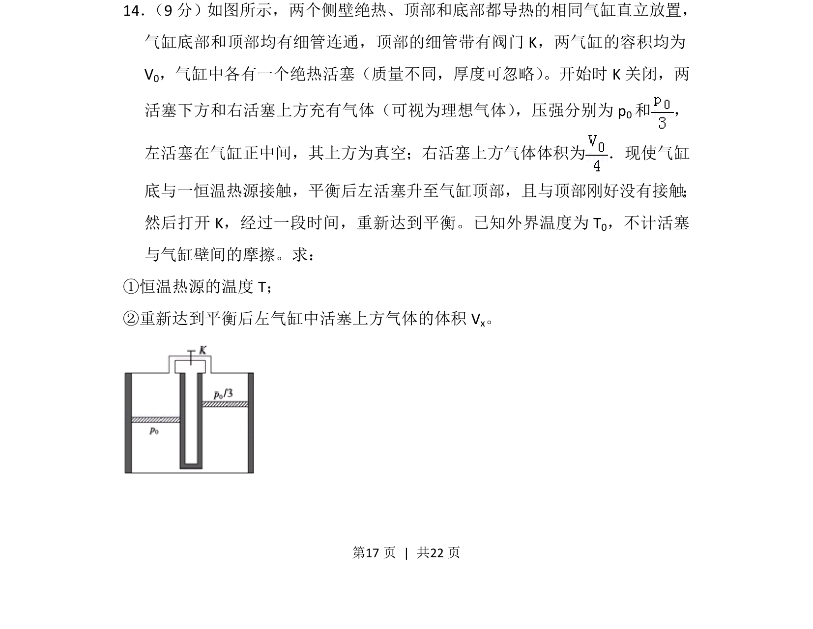
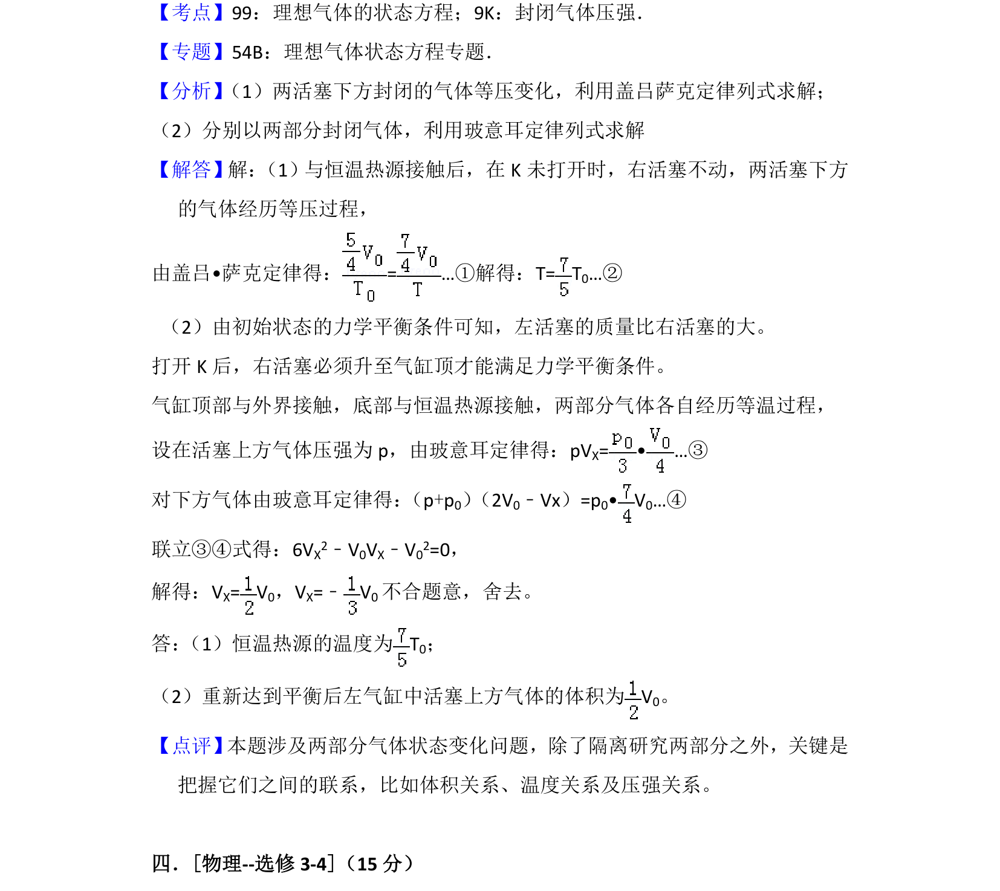

## 题面

## 摘要

两个气缸通过阀门连通，涉及理想气体等温、等压变化及活塞平衡问题。

## 关联考点

- [[446-理想气体状态方程|理想气体状态方程]]
- [[440-热力学第一定律|热力学第一定律]]
- [[549-压强平衡|压强平衡]]
- [[等温过程]]

## 答案与解析

> 📄 原 PDF 第 17 页：`素材/真题/湖南/2008-2024·（湖南）物理高考真题/2013年高考物理试卷（新课标Ⅰ）（解析卷）.pdf`

<!-- 题干文本-start -->
## 题干文本
14． （9分）如图所示，两个侧壁绝热、顶部和底部都导热的相同气缸直立放置，
气缸底部和顶部均有细管连通，顶部的细管带有阀门K，两气缸的容积均为
V0，气缸中各有一个绝热活塞（质量不同，厚度可忽略） 。开始时K关闭，两
活塞下方和右活塞上方充有气体（可视为理想气体） ，压强分别为p0和 ，
左活塞在气缸正中间，其上方为真空；右活塞上方气体体积为 ．现使气缸
底与一恒温热源接触，平衡后左活塞升至气缸顶部，且与顶部刚好没有接触；
然后打开K，经过一段时间，重新达到平衡。已知外界温度为T 0，不计活塞
与气缸壁间的摩擦。求：
①恒温热源的温度T；
②重新达到平衡后左气缸中活塞上方气体的体积V x。
<!-- 题干文本-end -->

<!-- 解析文本-start -->
## 解析文本

<!-- 解析文本-end -->
