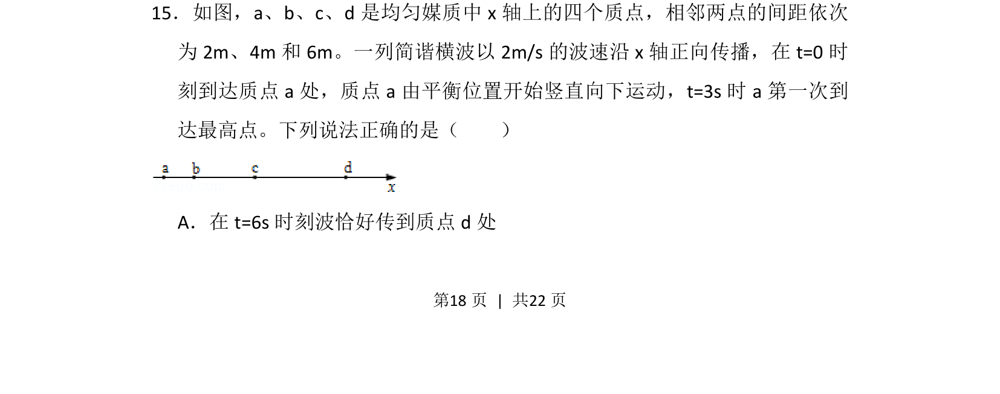
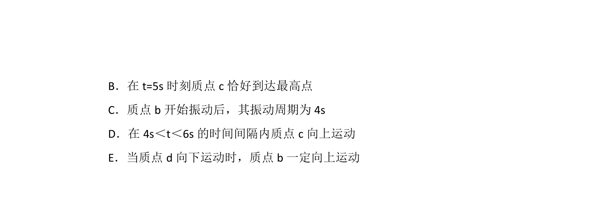
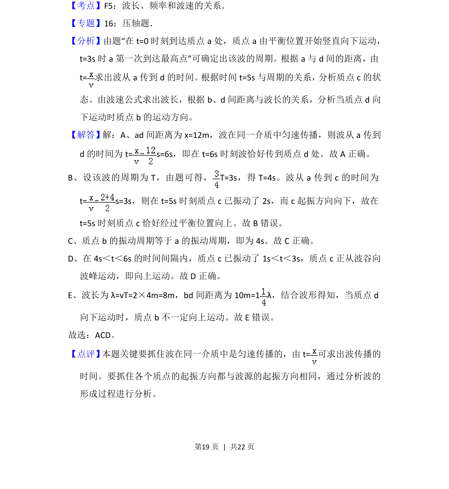

## 题面

## 摘要

一列简谐横波传播，根据质点起振方向和时间求周期，再计算波传到某点的时间。

## 关联考点

- [[362-机械波|机械波]]
- [[波速公式]]
- [[261-周期|周期]]
- [[478-波的传播|波的传播]]

## 答案与解析

> 📄 原 PDF 第 18 页：`素材/真题/湖南/2008-2024·（湖南）物理高考真题/2013年高考物理试卷（新课标Ⅰ）（解析卷）.pdf`
