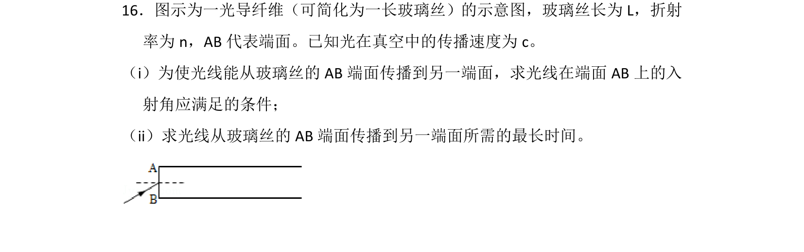
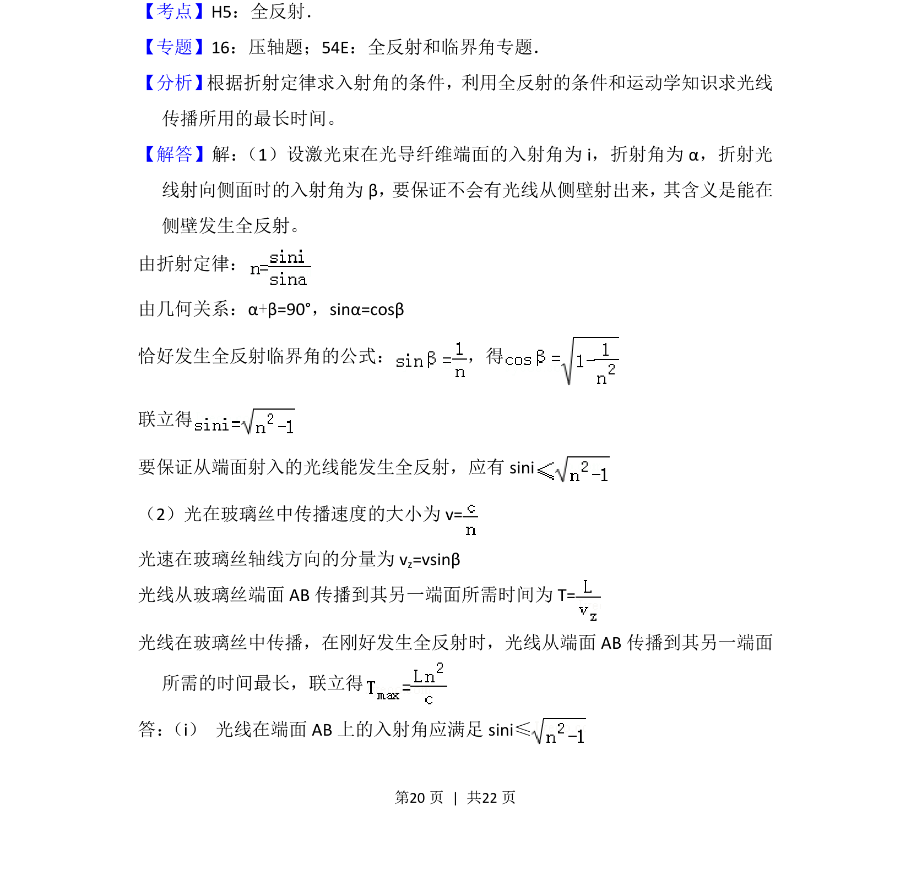
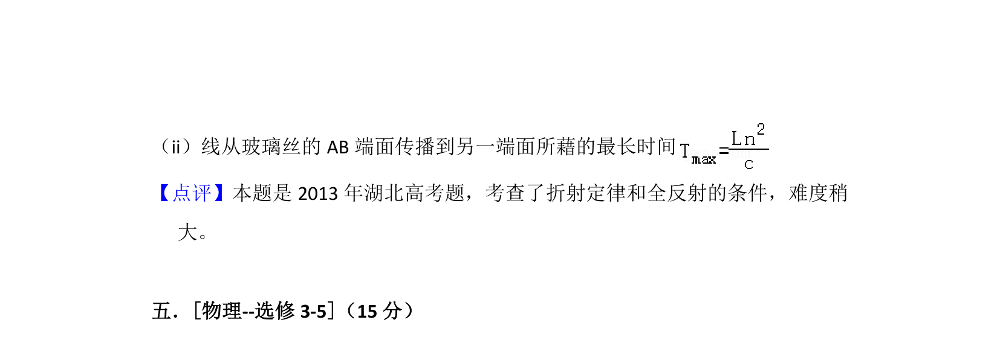

## 题面

## 摘要

光导纤维中利用全反射求光线入射角条件及传播最长时间。

## 关联考点

- [[343-全反射|全反射]]
- [[026-折射定律|折射定律]]
- [[光速分解]]
- [[336-临界角|临界角]]

## 答案与解析

> 📄 原 PDF 第 20 页：`素材/真题/湖南/2008-2024·（湖南）物理高考真题/2013年高考物理试卷（新课标Ⅰ）（解析卷）.pdf`
