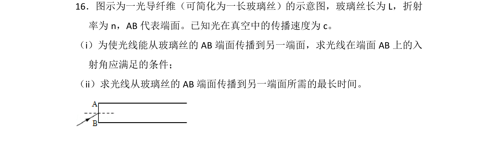
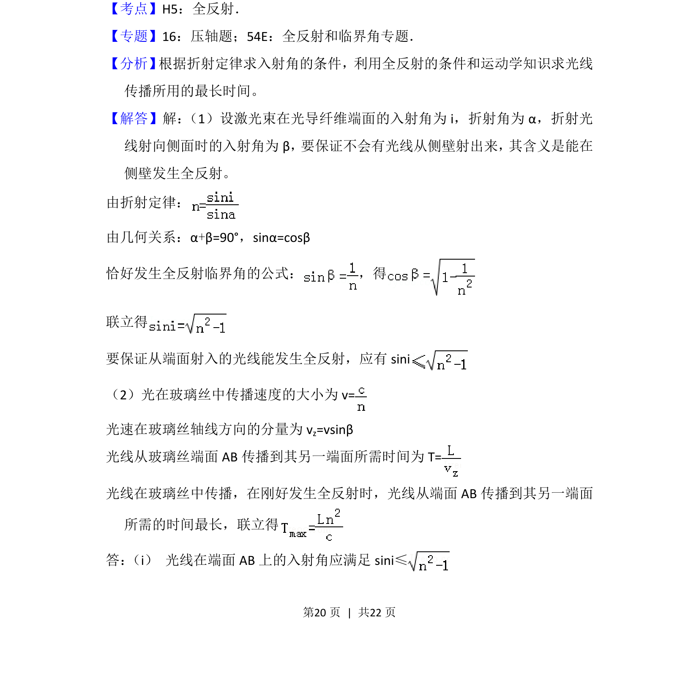
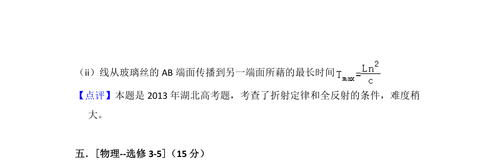

## 题面

## 摘要

光导纤维中利用全反射求光线入射角条件及传播最长时间。

## 关联考点

- [[343-全反射|全反射]]
- [[026-折射定律|折射定律]]
- [[光速分解]]
- [[336-临界角|临界角]]

## 答案与解析

> 📄 原 PDF 第 20 页：`素材/真题/湖南/2008-2024·（湖南）物理高考真题/2013年高考物理试卷（新课标Ⅰ）（解析卷）.pdf`

<!-- 题干文本-start -->
## 题干文本
16．图示为一光导纤维（可简化为一长玻璃丝）的示意图，玻璃丝长为L，折射
率为n，AB代表端面。已知光在真空中的传播速度为c。
（i）为使光线能从玻璃丝的AB端面传播到另一端面，求光线在端面AB上的入
射角应满足的条件；
（ii）求光线从玻璃丝的AB端面传播到另一端面所需的最长时间。
<!-- 题干文本-end -->

<!-- 解析文本-start -->
## 解析文本
【考点】H5：全反射．菁优网版权所有
【专题】16：压轴题；54E：全反射和临界角专题．
【分析】 根据折射定律求入射角的条件，利用全反射的条件和运动学知识求光线
传播所用的最长时间。
【解答】解： （1）设激光束在光导纤维端面的入射角为i，折射角为α，折射光
线射向侧面时的入射角为β，要保证不会有光线从侧壁射出来，其含义是能在
侧壁发生全反射。
由折射定律：
由几何关系：α+β=90°，sinα=cosβ
恰好发生全反射临界角的公式： ，得
联立得
要保证从端面射入的光线能发生全反射，应有sini
（2）光在玻璃丝中传播速度的大小为v=
光速在玻璃丝轴线方向的分量为v z=vsinβ
光线从玻璃丝端面AB传播到其另一端面所需时间为T=
光线在玻璃丝中传播，在刚好发生全反射时，光线从端面AB传播到其另一端面
所需的时间最长，联立得
答： （i） 光线在端面AB上的入射角应满足sini≤
<!-- 解析文本-end -->
