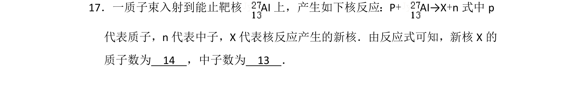
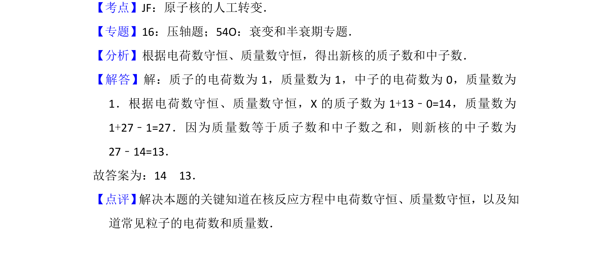

## 题面

## 摘要

核反应方程中根据电荷数守恒和质量数守恒计算新核的质子数与中子数。

## 关联考点

- [[原子核的人工转变]]
- [[689-电荷数守恒|电荷数守恒]]
- [[728-质量数守恒|质量数守恒]]

## 答案与解析

> 📄 原 PDF 第 21 页：`素材/真题/湖南/2008-2024·（湖南）物理高考真题/2013年高考物理试卷（新课标Ⅰ）（解析卷）.pdf`
