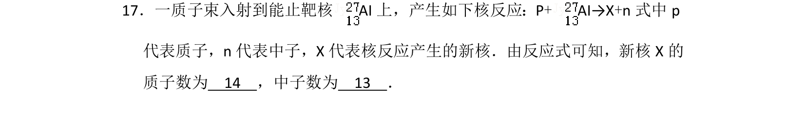
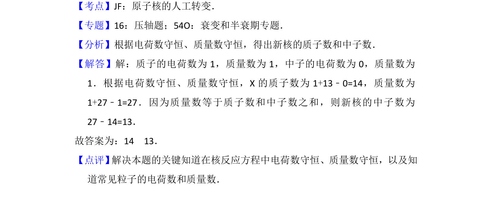

## 题面

## 摘要

核反应方程中根据电荷数守恒和质量数守恒计算新核的质子数与中子数。

## 关联考点

- [[原子核的人工转变]]
- [[689-电荷数守恒|电荷数守恒]]
- [[728-质量数守恒|质量数守恒]]

## 答案与解析

> 📄 原 PDF 第 21 页：`素材/真题/湖南/2008-2024·（湖南）物理高考真题/2013年高考物理试卷（新课标Ⅰ）（解析卷）.pdf`

<!-- 题干文本-start -->
## 题干文本
17．一质子束入射到能止靶核AI上，产生如下核反应：P+AI→X+n式中p
代表质子，n代表中子，X代表核反应产生的新核．由反应式可知，新核X的
质子数为　14　，中子数为　13　．
<!-- 题干文本-end -->

<!-- 解析文本-start -->
## 解析文本
【考点】JF：原子核的人工转变．菁优网版权所有
【专题】16：压轴题；54O：衰变和半衰期专题．
【分析】根据电荷数守恒、质量数守恒，得出新核的质子数和中子数．
【解答】解：质子的电荷数为1，质量数为1，中子的电荷数为0，质量数为
1．根据电荷数守恒、质量数守恒，X的质子数为1+13﹣0=14，质量数为
1+27﹣1=27．因为质量数等于质子数和中子数之和，则新核的中子数为
27﹣14=13．
故答案为：14  13．
【点评】 解决本题的关键知道在核反应方程中电荷数守恒、质量数守恒，以及知
道常见粒子的电荷数和质量数．
<!-- 解析文本-end -->
