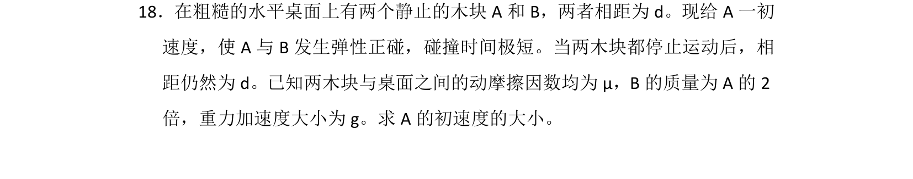
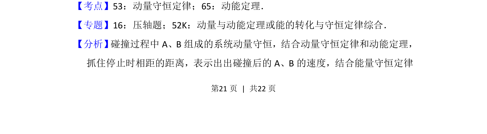
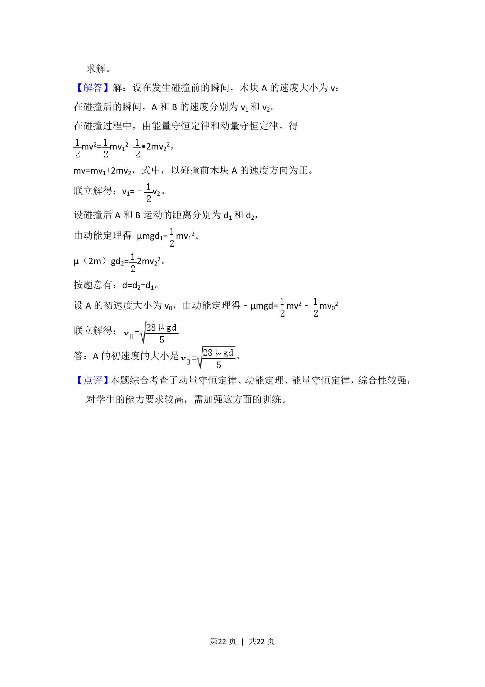

## 题面

## 摘要

A与B弹性碰撞后，结合动摩擦因数下的匀减速运动，根据停止时相距仍为d求初速度。

## 关联考点

- [[347-动量守恒定律|动量守恒定律]]
- [[359-弹性碰撞|弹性碰撞]]
- [[251-动能定理|动能定理]]
- [[215-匀变速直线运动|匀变速直线运动]]

## 答案与解析

> 📄 原 PDF 第 21 页：`素材/真题/湖南/2008-2024·（湖南）物理高考真题/2013年高考物理试卷（新课标Ⅰ）（解析卷）.pdf`
