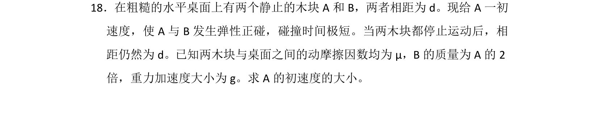
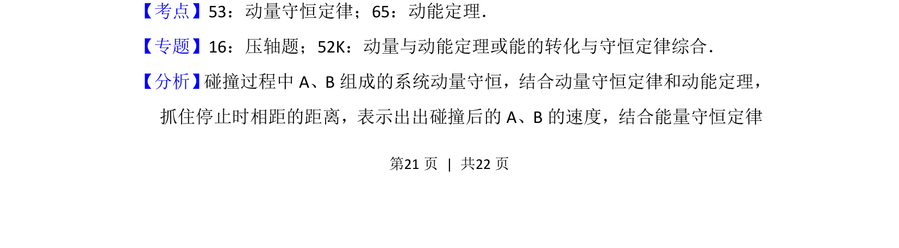
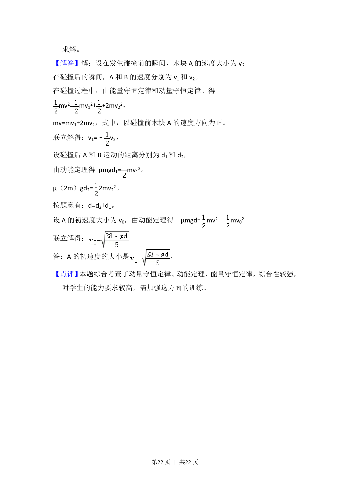

## 题面

## 摘要

A与B弹性碰撞后，结合动摩擦因数下的匀减速运动，根据停止时相距仍为d求初速度。

## 关联考点

- [[347-动量守恒定律|动量守恒定律]]
- [[359-弹性碰撞|弹性碰撞]]
- [[251-动能定理|动能定理]]
- [[215-匀变速直线运动|匀变速直线运动]]

## 答案与解析

> 📄 原 PDF 第 21 页：`素材/真题/湖南/2008-2024·（湖南）物理高考真题/2013年高考物理试卷（新课标Ⅰ）（解析卷）.pdf`

<!-- 题干文本-start -->
## 题干文本
18．在粗糙的水平桌面上有两个静止的木块A和B，两者相距为d。现给A一初
速度，使A与B发生弹性正碰，碰撞时间极短。当两木块都停止运动后，相
距仍然为d。已知两木块与桌面之间的动摩擦因数均为μ，B的质量为A的2
倍，重力加速度大小为g。求A的初速度的大小。
<!-- 题干文本-end -->

<!-- 解析文本-start -->
## 解析文本
【考点】53：动量守恒定律；65：动能定理．菁优网版权所有
【专题】16：压轴题；52K：动量与动能定理或能的转化与守恒定律综合．
【分析】 碰撞过程中A、B组成的系统动量守恒，结合动量守恒定律和动能定理，
抓住停止时相距的距离，表示出出碰撞后的A、B的速度，结合能量守恒定律
<!-- 解析文本-end -->
