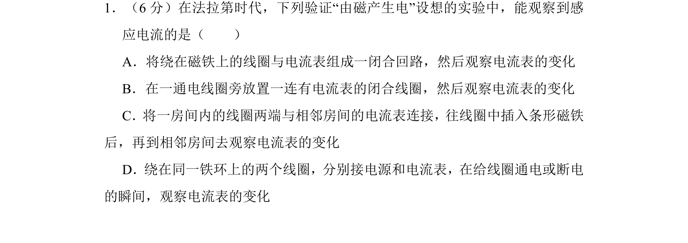
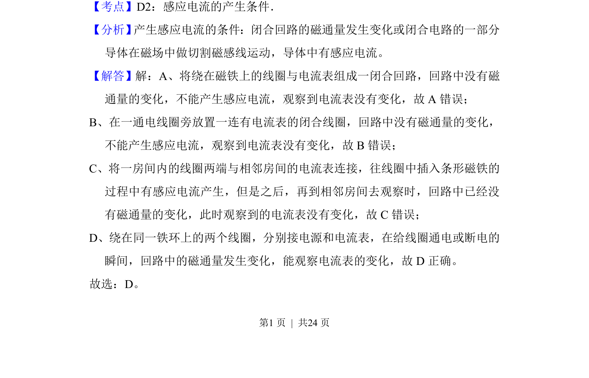

## 题面

## 摘要

该题考查产生感应电流的条件，即闭合回路中磁通量是否发生变化。

## 关联考点

- [[感应电流的产生条件]]
- [[325-磁通量|磁通量]]
- [[402-电磁感应现象|电磁感应现象]]

## 答案与解析

> 📄 原 PDF 第 1 页：`素材/真题/湖南/2008-2024·（湖南）物理高考真题/2014年高考物理试卷（新课标Ⅰ）（解析卷）.pdf`
