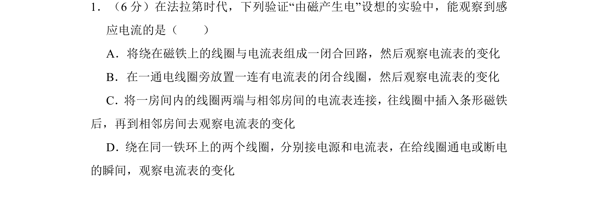
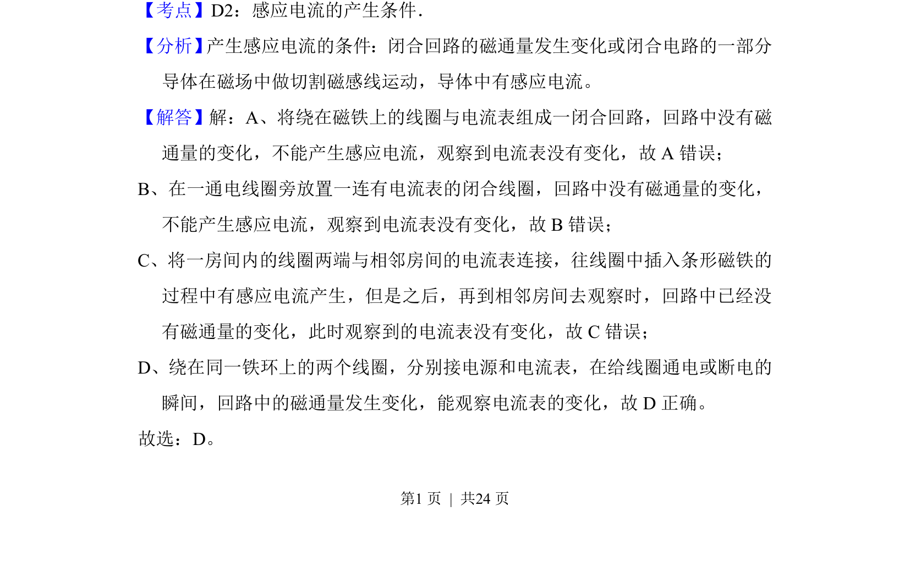

## 题面

## 摘要

该题考查产生感应电流的条件，即闭合回路中磁通量是否发生变化。

## 关联考点

- [[感应电流的产生条件]]
- [[325-磁通量|磁通量]]
- [[402-电磁感应现象|电磁感应现象]]

## 答案与解析

> 📄 原 PDF 第 1 页：`素材/真题/湖南/2008-2024·（湖南）物理高考真题/2014年高考物理试卷（新课标Ⅰ）（解析卷）.pdf`

<!-- 题干文本-start -->
## 题干文本
1．（6分）在法拉第时代，下列验证“由磁产生电”设想的实验中，能观察到感
应电流的是（　　）
A．将绕在磁铁上的线圈与电流表组成一闭合回路，然后观察电流表的变化
B．在一通电线圈旁放置一连有电流表的闭合线圈，然后观察电流表的变化
C．将一房间内的线圈两端与相邻房间的电流表连接，往线圈中插入条形磁铁
后，再到相邻房间去观察电流表的变化
D．绕在同一铁环上的两个线圈，分别接电源和电流表，在给线圈通电或断电
的瞬间，观察电流表的变化
<!-- 题干文本-end -->

<!-- 解析文本-start -->
## 解析文本
【考点】D2：感应电流的产生条件．菁优网版权所有
【分析】 产生感应电流的条件：闭合回路的磁通量发生变化或闭合电路的一部分
导体在磁场中做切割磁感线运动，导体中有感应电流。
【解答】解：A、将绕在磁铁上的线圈与电流表组成一闭合回路，回路中没有磁
通量的变化，不能产生感应电流，观察到电流表没有变化，故A错误；
B、在一通电线圈旁放置一连有电流表的闭合线圈，回路中没有磁通量的变化，
不能产生感应电流，观察到电流表没有变化，故B错误；
C、将一房间内的线圈两端与相邻房间的电流表连接，往线圈中插入条形磁铁的
过程中有感应电流产生，但是之后，再到相邻房间去观察时，回路中已经没
有磁通量的变化，此时观察到的电流表没有变化，故C错误；
D、绕在同一铁环上的两个线圈，分别接电源和电流表，在给线圈通电或断电的
瞬间，回路中的磁通量发生变化，能观察电流表的变化，故D正确。
故选：D。
<!-- 解析文本-end -->
