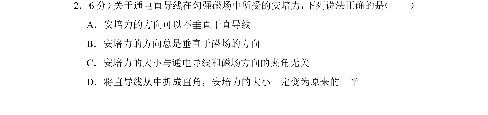
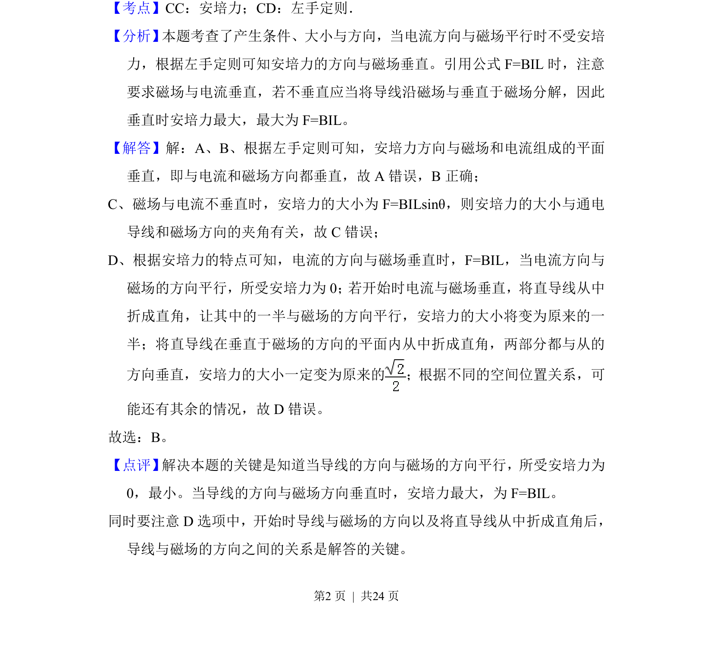

## 题面

## 摘要

通电直导线在匀强磁场中所受安培力的方向和大小，涉及左手定则与夹角关系

## 关联考点

- [[188-磁场对通电导体的作用|安培力]]
- [[297-安培力方向-左手定则|左手定则]]

## 答案与解析

> 📄 原 PDF 第 2 页：`素材/真题/湖南/2008-2024·（湖南）物理高考真题/2014年高考物理试卷（新课标Ⅰ）（解析卷）.pdf`

<!-- 题干文本-start -->
## 题干文本
2． （6分） 关于通电直导线在匀强磁场中所受的安培力， 下列说法正确的是 （　　）
A．安培力的方向可以不垂直于直导线
B．安培力的方向总是垂直于磁场的方向
C．安培力的大小与通电导线和磁场方向的夹角无关
D．将直导线从中折成直角，安培力的大小一定变为原来的一半
<!-- 题干文本-end -->

<!-- 解析文本-start -->
## 解析文本
【考点】CC：安培力；CD：左手定则．菁优网版权所有
【分析】 本题考查了产生条件、大小与方向，当电流方向与磁场平行时不受安培
力，根据左手定则可知安培力的方向与磁场垂直。引用公式F=BIL时，注意
要求磁场与电流垂直，若不垂直应当将导线沿磁场与垂直于磁场分解，因此
垂直时安培力最大，最大为F=BIL。
【解答】解：A、B、根据左手定则可知，安培力方向与磁场和电流组成的平面
垂直，即与电流和磁场方向都垂直，故A错误，B正确；
C、磁场与电流不垂直时，安培力的大小为F=BILsinθ，则安培力的大小与通电
导线和磁场方向的夹角有关，故C错误；
D、根据安培力的特点可知，电流的方向与磁场垂直时，F=BIL，当电流方向与
磁场的方向平行，所受安培力为0； 若开始时电流与磁场垂直，将直导线从中
折成直角，让其中的一半与磁场的方向平行，安培力的大小将变为原来的一
半；将直导线在垂直于磁场的方向的平面内从中折成直角，两部分都与从的
方向垂直，安培力的大小一定变为原来的 ；根据不同的空间位置关系，可
能还有其余的情况，故D错误。
故选：B。
【点评】 解决本题的关键是知道当导线的方向与磁场的方向平行，所受安培力为
0，最小。当导线的方向与磁场方向垂直时，安培力最大，为F=BIL。
同时要注意D选项中，开始时导线与磁场的方向以及将直导线从中折成直角后，
导线与磁场的方向之间的关系是解答的关键。
<!-- 解析文本-end -->
