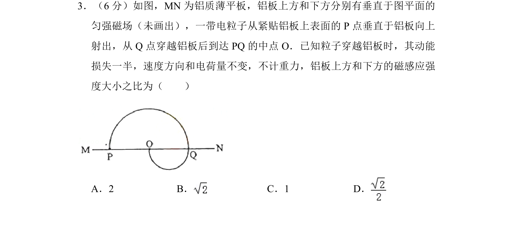
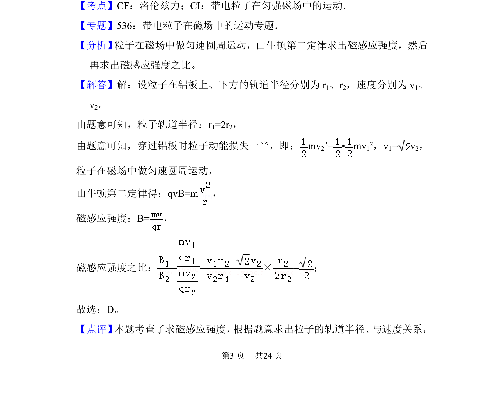

## 题面

## 摘要

带电粒子在匀强磁场中做圆周运动，结合动能损失条件求上下区域磁感应强度之比

## 关联考点

- [[304-洛伦兹力|洛伦兹力]]
- [[595-带电粒子在匀强磁场中的运动|带电粒子在匀强磁场中的运动]]
- [[067-动能|动能]]
- [[258-圆周运动|圆周运动]]

## 答案与解析

> 📄 原 PDF 第 3 页：`素材/真题/湖南/2008-2024·（湖南）物理高考真题/2014年高考物理试卷（新课标Ⅰ）（解析卷）.pdf`
