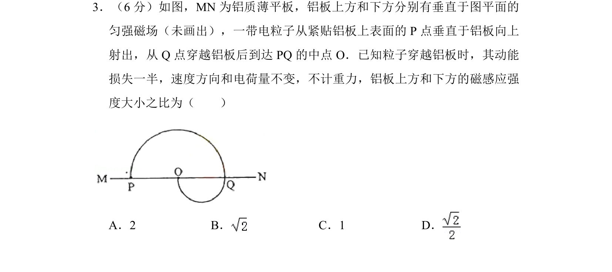
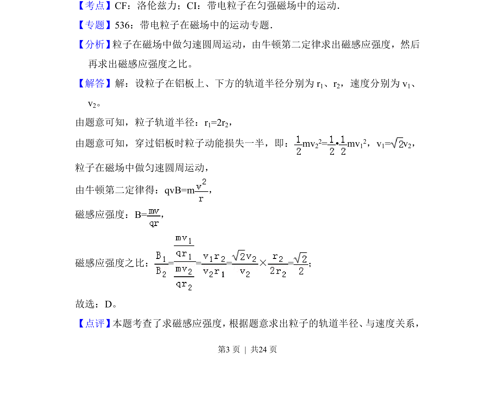

## 题面

## 摘要

带电粒子在匀强磁场中做圆周运动，结合动能损失条件求上下区域磁感应强度之比

## 关联考点

- [[304-洛伦兹力|洛伦兹力]]
- [[595-带电粒子在匀强磁场中的运动|带电粒子在匀强磁场中的运动]]
- [[067-动能|动能]]
- [[258-圆周运动|圆周运动]]

## 答案与解析

> 📄 原 PDF 第 3 页：`素材/真题/湖南/2008-2024·（湖南）物理高考真题/2014年高考物理试卷（新课标Ⅰ）（解析卷）.pdf`

<!-- 题干文本-start -->
## 题干文本
3．（6分）如图，MN为铝质薄平板，铝板上方和下方分别有垂直于图平面的
匀强磁场（未画出），一带电粒子从紧贴铝板上表面的P点垂直于铝板向上
射出，从Q点穿越铝板后到达PQ的中点O．已知粒子穿越铝板时，其动能
损失一半，速度方向和电荷量不变，不计重力，铝板上方和下方的磁感应强
度大小之比为（　　）
A．2 B．C．1 D．
<!-- 题干文本-end -->

<!-- 解析文本-start -->
## 解析文本
【考点】CF：洛伦兹力；CI：带电粒子在匀强磁场中的运动．菁优网版权所有
【专题】536：带电粒子在磁场中的运动专题．
【分析】 粒子在磁场中做匀速圆周运动，由牛顿第二定律求出磁感应强度，然后
再求出磁感应强度之比。
【解答】解：设粒子在铝板上、下方的轨道半径分别为r 1、r2，速度分别为v 1、
v2。
由题意可知，粒子轨道半径：r1=2r2，
由题意可知，穿过铝板时粒子动能损失一半，即：mv 22= • mv 12，v1= v 2，
粒子在磁场中做匀速圆周运动，
由牛顿第二定律得：qvB=m，
磁感应强度：B=，
磁感应强度之比：= = =×=；
故选：D。
【点评】 本题考查了求磁感应强度， 根据题意求出粒子的轨道半径、 与速度关系，
<!-- 解析文本-end -->
