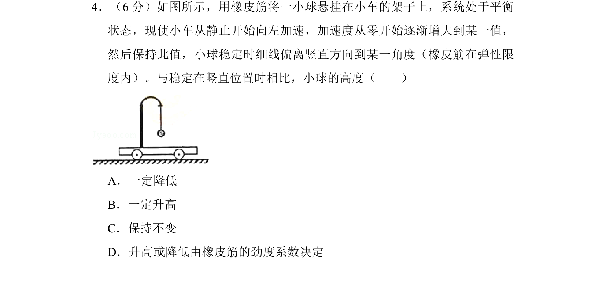
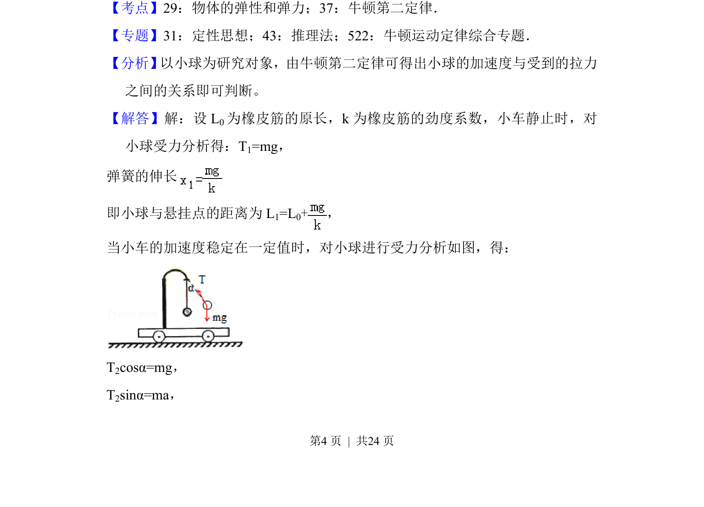
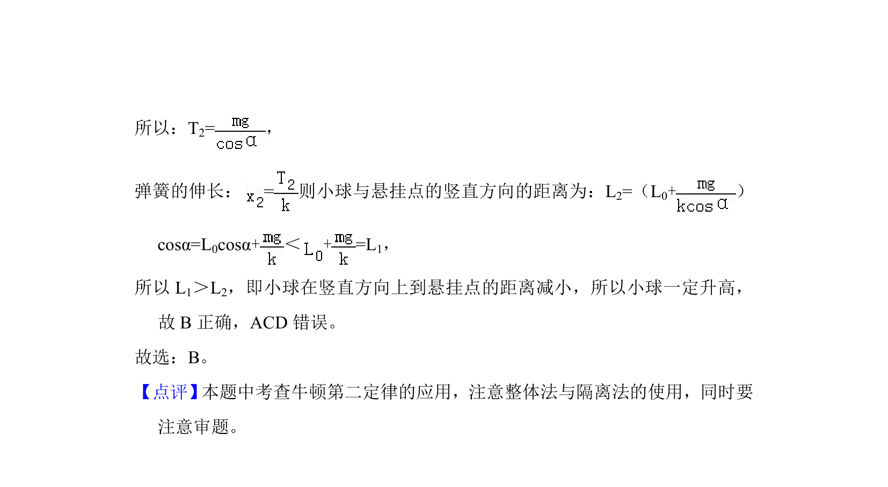

## 题面

## 摘要

小车加速时，橡皮筋悬挂的小球偏离竖直方向，分析其高度变化。

## 关联考点

- [[078-弹力|弹力]]
- [[229-牛顿第二定律|牛顿第二定律]]

## 答案与解析

> 📄 原 PDF 第 4 页：`素材/真题/湖南/2008-2024·（湖南）物理高考真题/2014年高考物理试卷（新课标Ⅰ）（解析卷）.pdf`

<!-- 题干文本-start -->
## 题干文本
4．（6分）如图所示，用橡皮筋将一小球悬挂在小车的架子上，系统处于平衡
状态，现使小车从静止开始向左加速，加速度从零开始逐渐增大到某一值，
然后保持此值，小球稳定时细线偏离竖直方向到某一角度（橡皮筋在弹性限
度内）。与稳定在竖直位置时相比，小球的高度（　　）
A．一定降低
B．一定升高
C．保持不变
D．升高或降低由橡皮筋的劲度系数决定
<!-- 题干文本-end -->

<!-- 解析文本-start -->
## 解析文本
【考点】29：物体的弹性和弹力；37：牛顿第二定律．菁优网版权所有
【专题】31：定性思想；43：推理法；522：牛顿运动定律综合专题．
【分析】 以小球为研究对象，由牛顿第二定律可得出小球的加速度与受到的拉力
之间的关系即可判断。
【解答】解：设L 0为橡皮筋的原长，k为橡皮筋的劲度系数，小车静止时，对
小球受力分析得：T1=mg，
弹簧的伸长
即小球与悬挂点的距离为L 1=L0+，
当小车的加速度稳定在一定值时，对小球进行受力分析如图，得：
T2cosα=mg，
T2sinα=ma，
<!-- 解析文本-end -->
