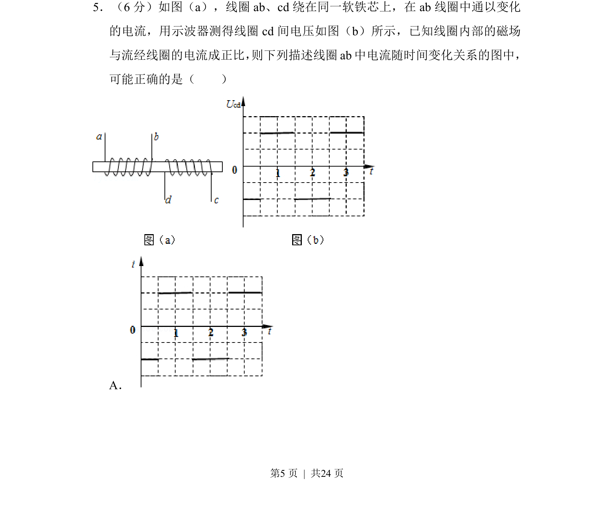
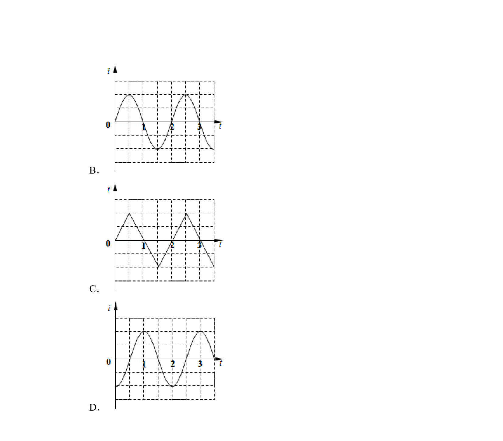
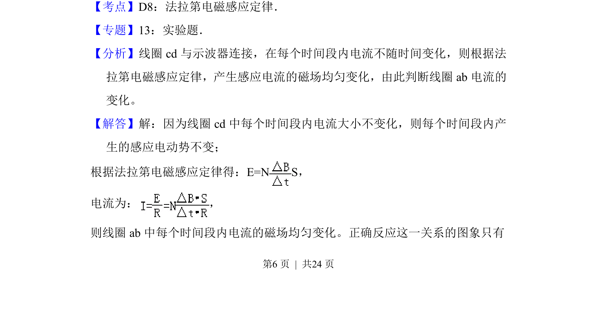
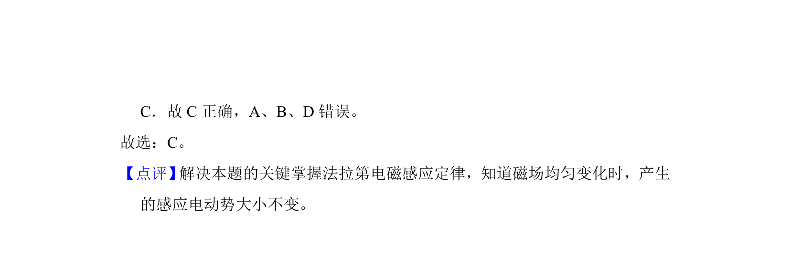

## 题面

## 摘要

互感现象与法拉第电磁感应定律，由cd间电压图像反推ab线圈电流变化率，进而判断电流图像。

## 关联考点

- [[377-互感|互感]]
- [[395-法拉第电磁感应定律|法拉第电磁感应定律]]
- [[电流变化率]]
- [[564-图像分析|图像分析]]

## 答案与解析

> 📄 原 PDF 第 5 页：`素材/真题/湖南/2008-2024·（湖南）物理高考真题/2014年高考物理试卷（新课标Ⅰ）（解析卷）.pdf`
