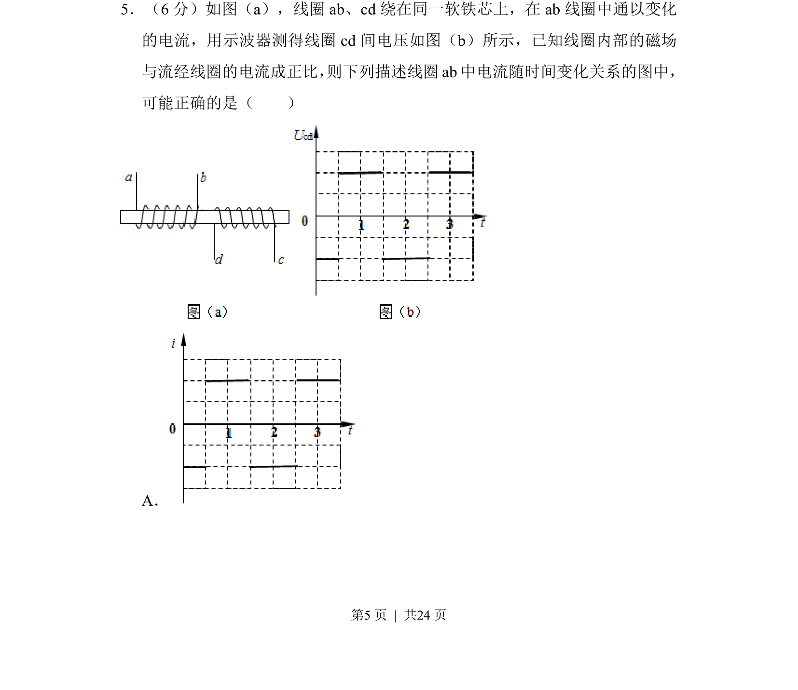
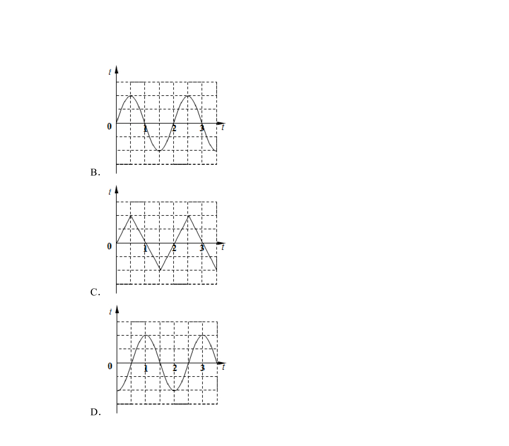
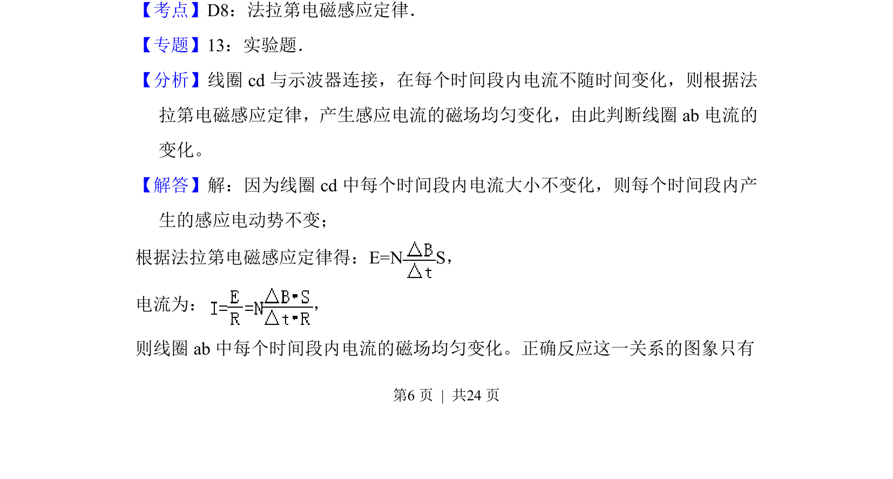
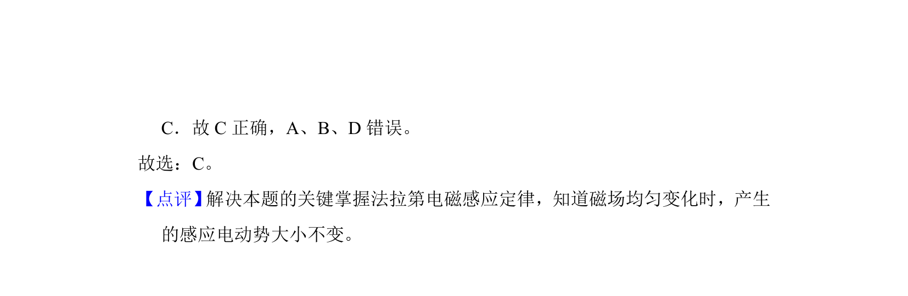

## 题面

## 摘要

互感现象与法拉第电磁感应定律，由cd间电压图像反推ab线圈电流变化率，进而判断电流图像。

## 关联考点

- [[377-互感|互感]]
- [[395-法拉第电磁感应定律|法拉第电磁感应定律]]
- [[电流变化率]]
- [[564-图像分析|图像分析]]

## 答案与解析

> 📄 原 PDF 第 5 页：`素材/真题/湖南/2008-2024·（湖南）物理高考真题/2014年高考物理试卷（新课标Ⅰ）（解析卷）.pdf`

<!-- 题干文本-start -->
## 题干文本
5．（6分）如图（a），线圈ab、cd绕在同一软铁芯上，在ab线圈中通以变化
的电流，用示波器测得线圈cd间电压如图（b）所示，已知线圈内部的磁场
与流经线圈的电流成正比， 则下列描述线圈ab中电流随时间变化关系的图中，
可能正确的是（　　）
A．
<!-- 题干文本-end -->

<!-- 解析文本-start -->
## 解析文本

<!-- 解析文本-end -->
