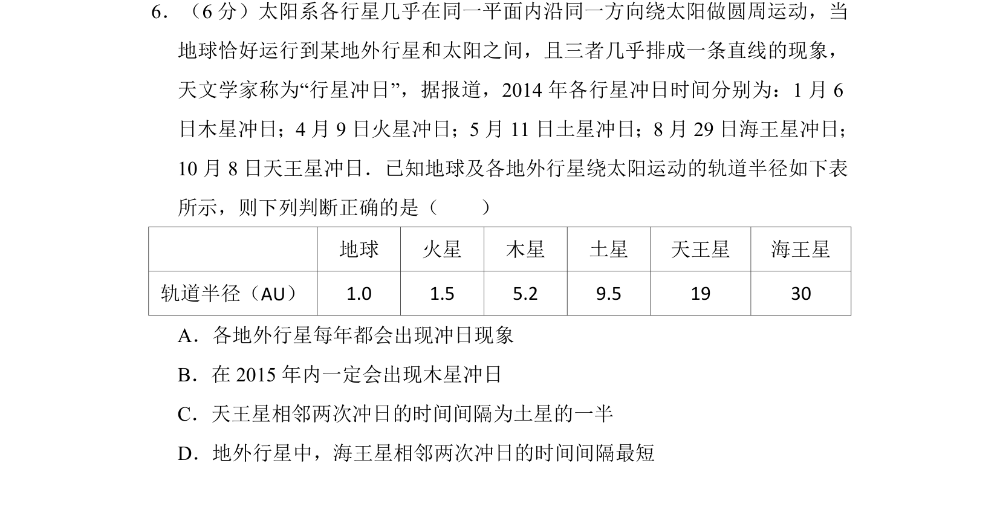
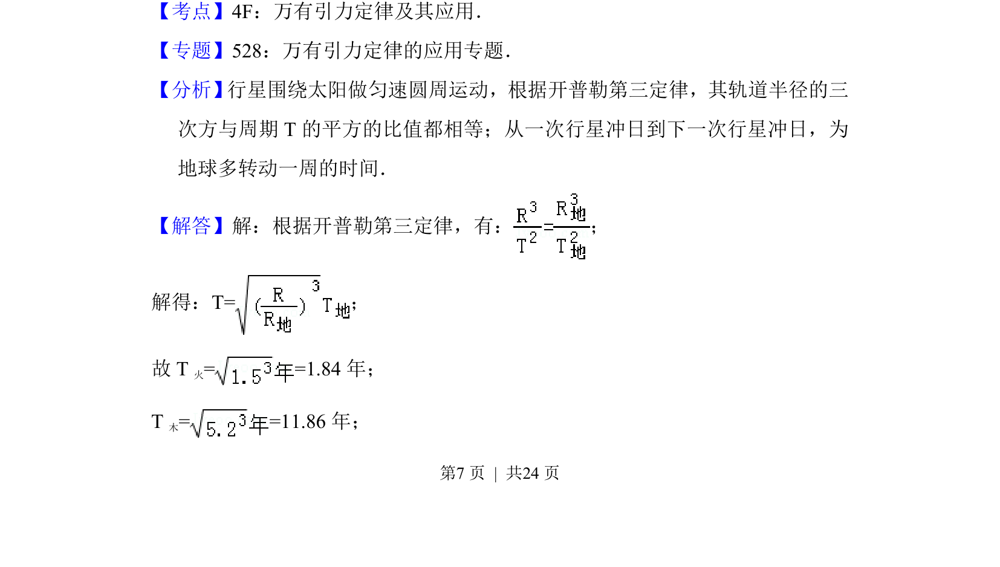
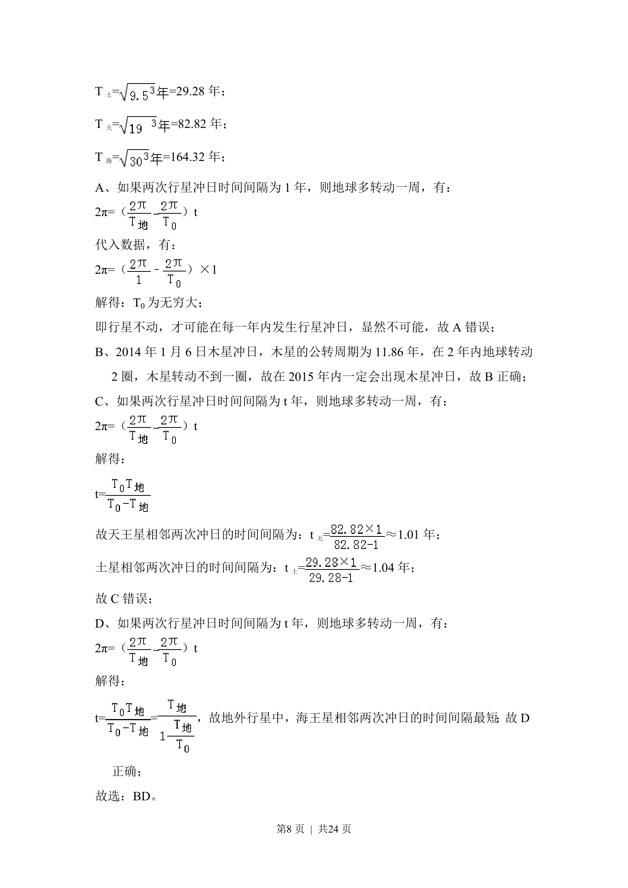
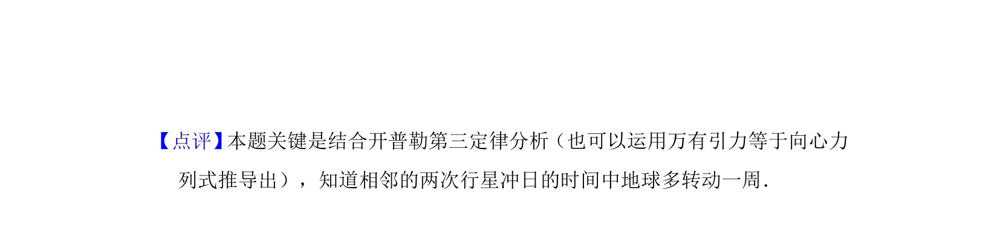

## 题面

## 摘要

本题考查开普勒第三定律与万有引力定律的应用，分析行星冲日现象的时间间隔和规律。

## 关联考点

- [[246-万有引力定律|万有引力定律]]
- [[266-开普勒第三定律|开普勒第三定律]]
- [[行星冲日]]
- [[261-周期|周期]]

## 答案与解析

> 📄 原 PDF 第 7 页：`素材/真题/湖南/2008-2024·（湖南）物理高考真题/2014年高考物理试卷（新课标Ⅰ）（解析卷）.pdf`
