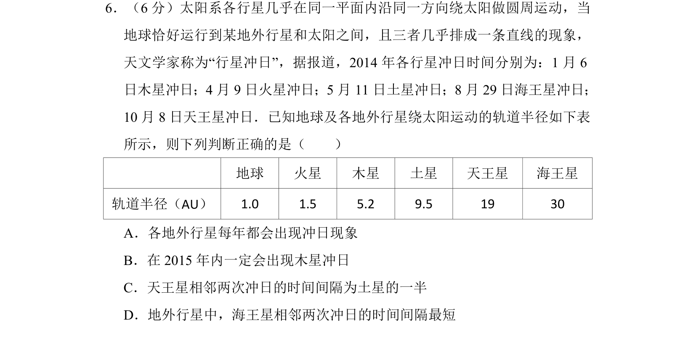
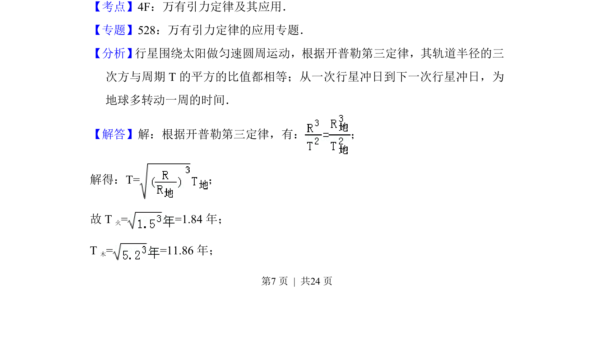
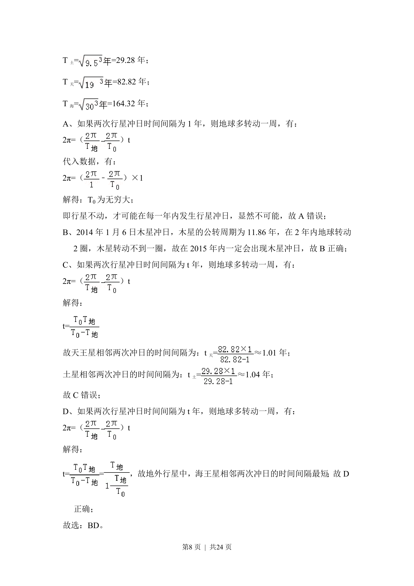
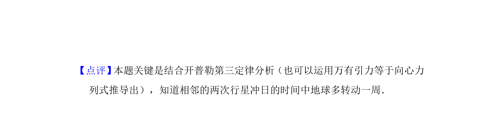

## 题面

## 摘要

本题考查开普勒第三定律与万有引力定律的应用，分析行星冲日现象的时间间隔和规律。

## 关联考点

- [[246-万有引力定律|万有引力定律]]
- [[266-开普勒第三定律|开普勒第三定律]]
- [[行星冲日]]
- [[261-周期|周期]]

## 答案与解析

> 📄 原 PDF 第 7 页：`素材/真题/湖南/2008-2024·（湖南）物理高考真题/2014年高考物理试卷（新课标Ⅰ）（解析卷）.pdf`

<!-- 题干文本-start -->
## 题干文本
6．（6分）太阳系各行星几乎在同一平面内沿同一方向绕太阳做圆周运动，当
地球恰好运行到某地外行星和太阳之间，且三者几乎排成一条直线的现象，
天文学家称为“行星冲日”，据报道，2014年各行星冲日时间分别为：1月6
日木星冲日；4月9日火星冲日；5月11日土星冲日；8月29日海王星冲日；
10月8日天王星冲日．已知地球及各地外行星绕太阳运动的轨道半径如下表
所示，则下列判断正确的是（　　）
地球 火星 木星 土星 天王星 海王星
轨道半径（AU） 1.0 1.5 5.2 9.5 19 30
A．各地外行星每年都会出现冲日现象
B．在2015年内一定会出现木星冲日
C．天王星相邻两次冲日的时间间隔为土星的一半
D．地外行星中，海王星相邻两次冲日的时间间隔最短
<!-- 题干文本-end -->

<!-- 解析文本-start -->
## 解析文本
【考点】4F：万有引力定律及其应用．菁优网版权所有
【专题】528：万有引力定律的应用专题．
【分析】 行星围绕太阳做匀速圆周运动，根据开普勒第三定律，其轨道半径的三
次方与周期T的平方的比值都相等；从一次行星冲日到下一次行星冲日，为
地球多转动一周的时间．
【解答】解：根据开普勒第三定律，有： ；
解得：T=；
故T 火= =1.84年；
T 木= =11.86年；
<!-- 解析文本-end -->
