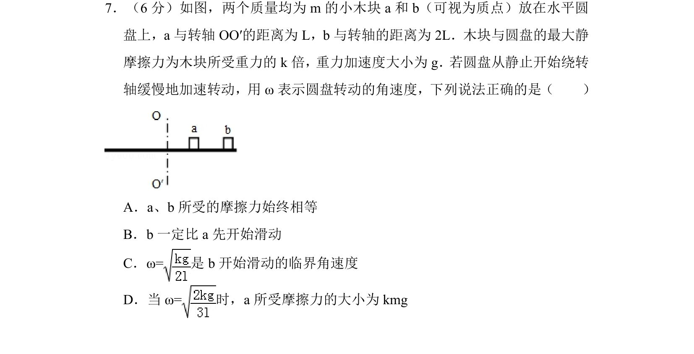
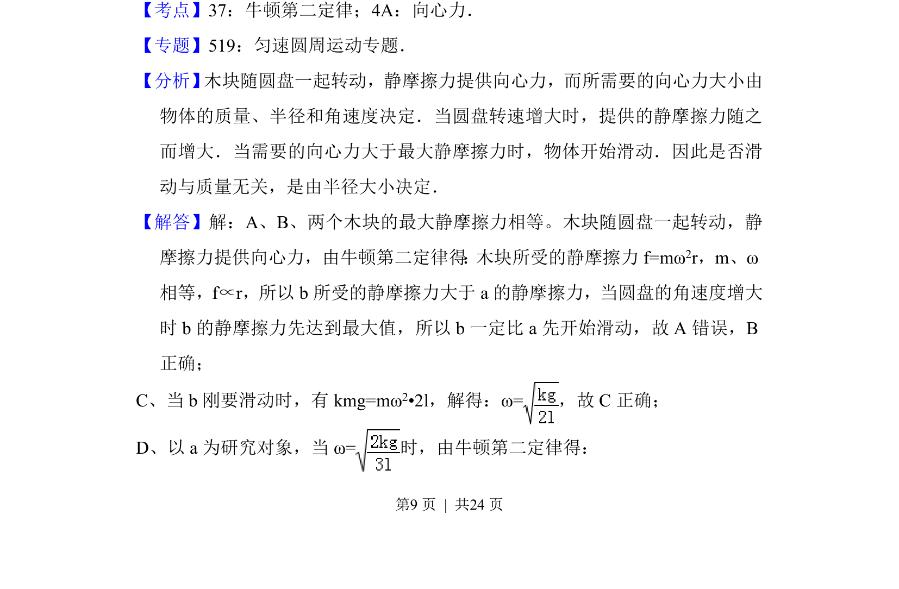
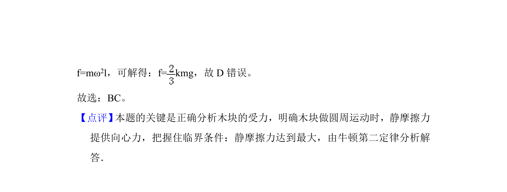

## 题面

## 摘要

两个小木块在水平圆盘上随盘转动，分析静摩擦力提供向心力及临界滑动条件。

## 关联考点

- [[256-向心力|向心力]]
- [[120-静摩擦力-初中|静摩擦力]]
- [[临界角速度]]
- [[229-牛顿第二定律|牛顿第二定律]]

## 答案与解析

> 📄 原 PDF 第 9 页：`素材/真题/湖南/2008-2024·（湖南）物理高考真题/2014年高考物理试卷（新课标Ⅰ）（解析卷）.pdf`
