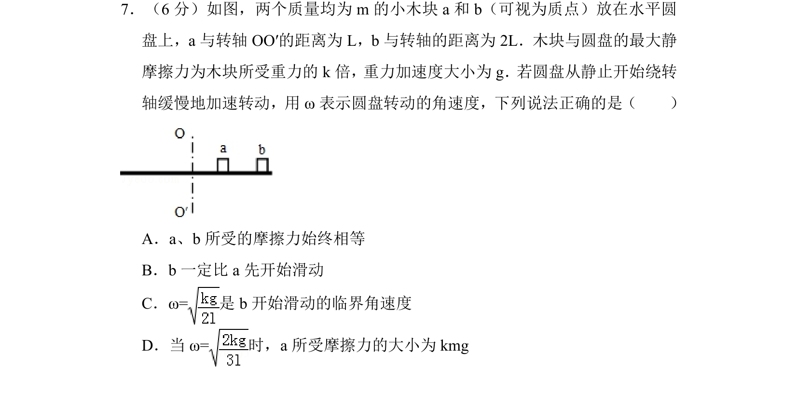
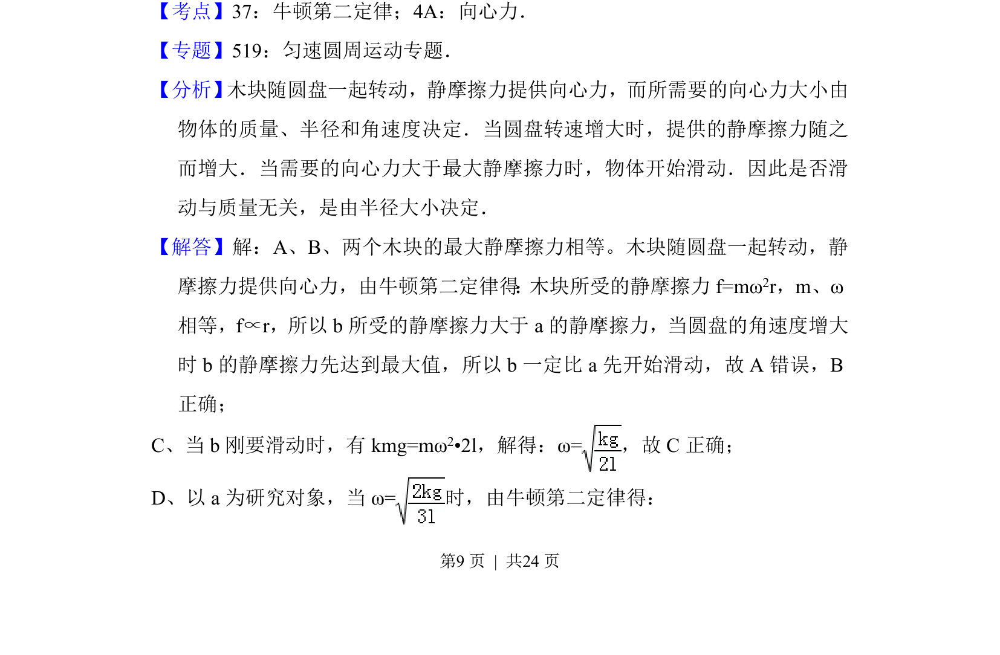
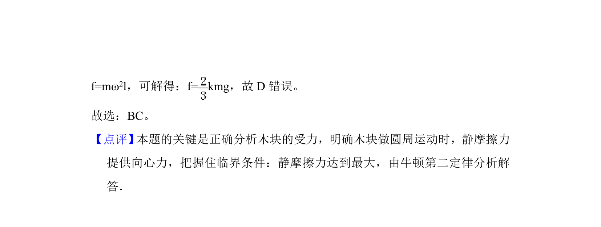

## 题面

## 摘要

两个小木块在水平圆盘上随盘转动，分析静摩擦力提供向心力及临界滑动条件。

## 关联考点

- [[256-向心力|向心力]]
- [[120-静摩擦力-初中|静摩擦力]]
- [[临界角速度]]
- [[229-牛顿第二定律|牛顿第二定律]]

## 答案与解析

> 📄 原 PDF 第 9 页：`素材/真题/湖南/2008-2024·（湖南）物理高考真题/2014年高考物理试卷（新课标Ⅰ）（解析卷）.pdf`

<!-- 题干文本-start -->
## 题干文本
7．（6分）如图，两个质量均为m的小木块a和b（可视为质点）放在水平圆
盘上，a与转轴OO′的距离为L，b与转轴的距离为2L．木块与圆盘的最大静
摩擦力为木块所受重力的k倍，重力加速度大小为g．若圆盘从静止开始绕转
轴缓慢地加速转动，用ω表示圆盘转动的角速度，下列说法正确的是（　　）
A．a、b所受的摩擦力始终相等
B．b一定比a先开始滑动
C．ω=是b开始滑动的临界角速度
D．当ω=时，a所受摩擦力的大小为kmg
<!-- 题干文本-end -->

<!-- 解析文本-start -->
## 解析文本
【考点】37：牛顿第二定律；4A：向心力．菁优网版权所有
【专题】519：匀速圆周运动专题．
【分析】 木块随圆盘一起转动，静摩擦力提供向心力，而所需要的向心力大小由
物体的质量、半径和角速度决定．当圆盘转速增大时，提供的静摩擦力随之
而增大．当需要的向心力大于最大静摩擦力时，物体开始滑动．因此是否滑
动与质量无关，是由半径大小决定．
【解答】解：A、B、两个木块的最大静摩擦力相等。木块随圆盘一起转动，静
摩擦力提供向心力，由牛顿第二定律得 ： 木块所受的静摩擦力f=mω2r，m、ω
相等，f∝r，所以b所受的静摩擦力大于a的静摩擦力，当圆盘的角速度增大
时b的静摩擦力先达到最大值，所以b一定比a先开始滑动，故A错误，B
正确；
C、当b刚要滑动时，有kmg=mω 2•2l，解得：ω=，故C正确；
D、以a为研究对象，当ω=时，由牛顿第二定律得：
<!-- 解析文本-end -->
