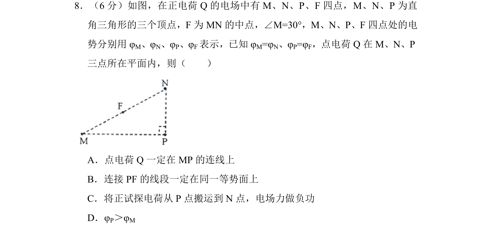
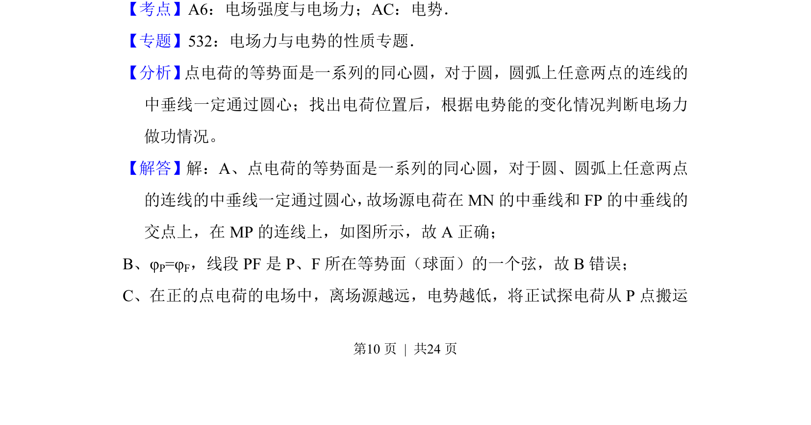
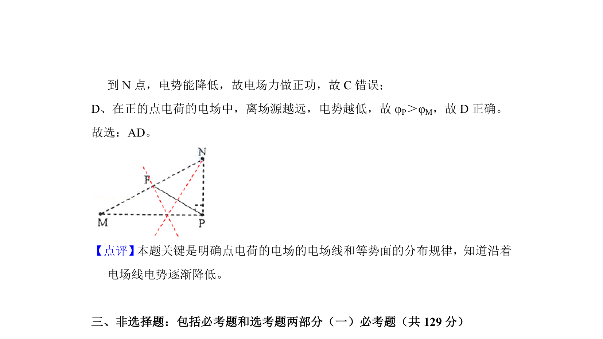

## 题面

## 摘要

点电荷电场中等势面分布规律，结合几何关系判断场源位置、电势高低及电场力做功

## 关联考点

- [[点电荷电场]]
- [[282-等势面|等势面]]
- [[308-电势|电势]]
- [[673-电场力做功|电场力做功]]

## 答案与解析

> 📄 原 PDF 第 10 页：`素材/真题/湖南/2008-2024·（湖南）物理高考真题/2014年高考物理试卷（新课标Ⅰ）（解析卷）.pdf`
