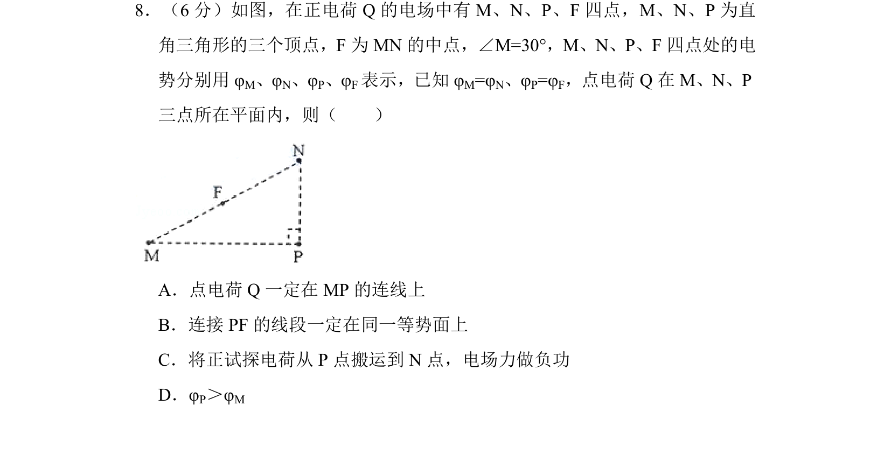
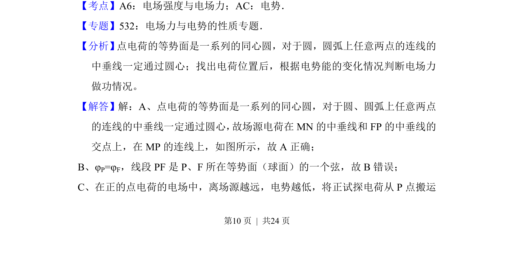
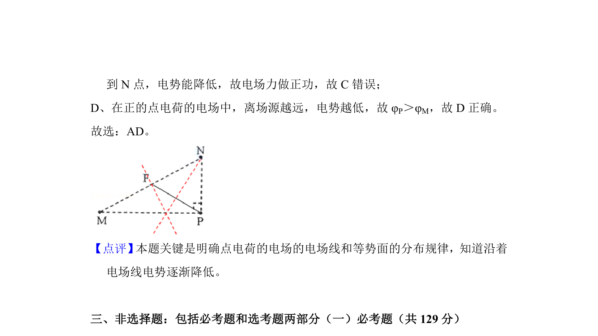

## 题面

## 摘要

点电荷电场中等势面分布规律，结合几何关系判断场源位置、电势高低及电场力做功

## 关联考点

- [[点电荷电场]]
- [[282-等势面|等势面]]
- [[308-电势|电势]]
- [[673-电场力做功|电场力做功]]

## 答案与解析

> 📄 原 PDF 第 10 页：`素材/真题/湖南/2008-2024·（湖南）物理高考真题/2014年高考物理试卷（新课标Ⅰ）（解析卷）.pdf`

<!-- 题干文本-start -->
## 题干文本
8．（6分）如图，在正电荷Q的电场中有M、N、P、F四点，M、N、P为直
角三角形的三个顶点，F为MN的中点，∠M=30°，M、N、P、F四点处的电
势分别用φ M、φN、φP、φF表示，已知φ M=φN、φP=φF，点电荷Q在M、N、P
三点所在平面内，则（　　）
A．点电荷Q一定在MP的连线上
B．连接PF的线段一定在同一等势面上
C．将正试探电荷从P点搬运到N点，电场力做负功
D．φP＞φM
<!-- 题干文本-end -->

<!-- 解析文本-start -->
## 解析文本
【考点】A6：电场强度与电场力；AC：电势．菁优网版权所有
【专题】532：电场力与电势的性质专题．
【分析】 点电荷的等势面是一系列的同心圆，对于圆，圆弧上任意两点的连线的
中垂线一定通过圆心；找出电荷位置后，根据电势能的变化情况判断电场力
做功情况。
【解答】解：A、点电荷的等势面是一系列的同心圆，对于圆、圆弧上任意两点
的连线的中垂线一定通过圆心， 故场源电荷在MN的中垂线和FP的中垂线的
交点上，在MP的连线上，如图所示，故A正确；
B、φP=φF，线段PF是P、F所在等势面（球面）的一个弦，故B错误；
C、在正的点电荷的电场中，离场源越远，电势越低，将正试探电荷从P点搬运
<!-- 解析文本-end -->
