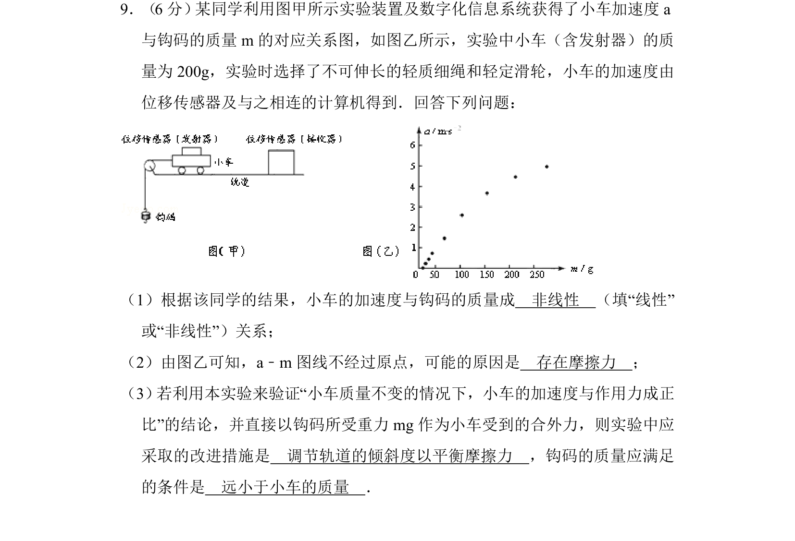
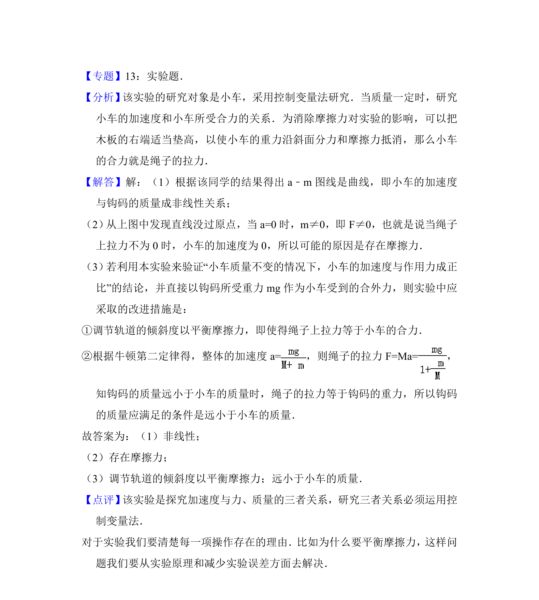

## 题面

## 摘要

探究加速度与钩码质量关系的实验，分析图线非线性及不过原点的原因，并提出改进措施及条件。

## 关联考点

- [[探究加速度与力]]
- [[质量的关系]]
- [[856-平衡摩擦力|平衡摩擦力]]
- [[104-物理实验-控制变量法|控制变量法]]
- [[583-实验条件|实验条件]]

## 答案与解析

> 📄 原 PDF 第 11 页：`素材/真题/湖南/2008-2024·（湖南）物理高考真题/2014年高考物理试卷（新课标Ⅰ）（解析卷）.pdf`
